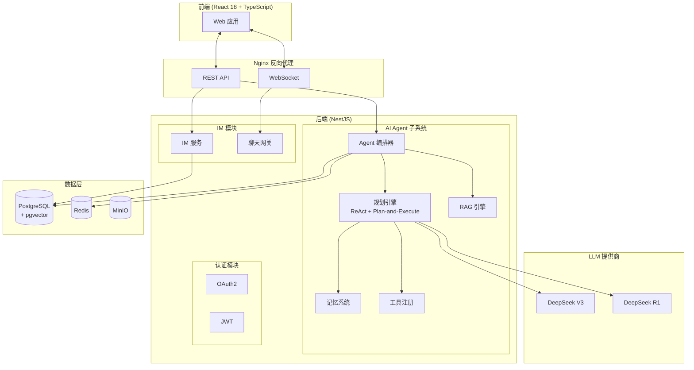

# AI-Native Chat System

一个由 React、NestJS 和 DeepSeek LLM 驱动的 AI 原生即时通讯系统。

## 系统架构



## 功能特性

- **即时通讯**：私聊、群聊，通过 WebSocket 实现实时消息
- **AI Agent**：ReAct + Plan-and-Execute 推理，工具编排，记忆管理
- **DeepSeek**：V3（快速）+ R1（深度推理）双模型支持
- **RAG**：基于向量搜索（pgvector）的知识库
- **OAuth2 + JWT**：安全的身份认证，支持 Token 刷新
- **Docker**：全容器化部署

## 快速开始

### 环境要求

- Docker 和 Docker Compose
- Node.js 20+（本地开发）

### 1. 克隆并配置

```bash
git clone <仓库地址>
cd new-chat-system
cp .env.example .env
# 编辑 .env，填入你的 DeepSeek API Key
```

### 2. 启动基础设施服务

```bash
docker-compose up -d postgres redis minio
```

### 3. 启动后端

```bash
cd apps/api
npm install
npx prisma db push
npm run start:dev
```

### 4. 启动前端

```bash
cd apps/web
npm install
npm run dev
```

### 5. 访问地址

- 前端：http://localhost:5173
- API：http://localhost:3000
- Swagger 文档：http://localhost:3000/api/docs

## 开发指南

### 后端

```bash
cd apps/api
npm run start:dev     # 热重载开发服务器
npm run lint          # 代码检查
npm run test          # 单元测试
npx prisma studio     # 数据库可视化工具
```

### 前端

```bash
cd apps/web
npm run dev           # 开发服务器
npm run build         # 生产构建
```

## API 接口

### 认证

| 方法 | 端点 | 描述 |
|------|------|------|
| POST | /api/v1/auth/register | 注册 |
| POST | /api/v1/auth/login | 登录 |
| POST | /api/v1/auth/refresh | 刷新 Token |
| POST | /api/v1/auth/logout | 登出 |

### 聊天

| 方法 | 端点 | 描述 |
|------|------|------|
| GET | /api/v1/chat/sessions | 获取会话列表 |
| POST | /api/v1/chat/sessions | 创建会话 |
| GET | /api/v1/chat/sessions/:id/messages | 获取消息 |
| POST | /api/v1/chat/sessions/:id/messages | 发送消息 |

### Agent

| 方法 | 端点 | 描述 |
|------|------|------|
| POST | /api/v1/agent/chat | AI 对话 |
| POST | /api/v1/agent/chat/stream | AI 对话（SSE 流式） |
| GET | /api/v1/agent/history | 对话历史 |
| DELETE | /api/v1/agent/memory | 清除记忆 |

### 知识库

| 方法 | 端点 | 描述 |
|------|------|------|
| GET | /api/v1/knowledge/bases | 获取知识库列表 |
| POST | /api/v1/knowledge/bases | 创建知识库 |
| POST | /api/v1/knowledge/bases/:kbId/text | 添加文本内容 |
| GET | /api/v1/knowledge/search | 知识检索 |

## 技术栈

| 层级 | 技术 |
|------|------|
| 前端 | React 18, TypeScript, Vite, Tailwind CSS, Zustand |
| 后端 | NestJS 10, TypeScript, Prisma |
| 数据库 | PostgreSQL 16, Redis 7 |
| 向量数据库 | pgvector |
| LLM | DeepSeek V3 + R1 |
| 容器化 | Docker, Docker Compose |
| 持续集成 | GitHub Actions |

## 开源协议

MIT
