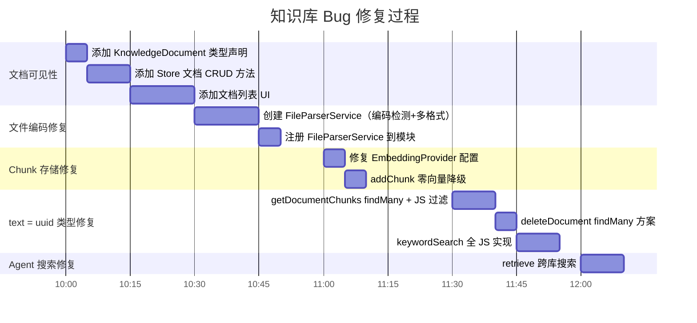

# 知识库模块 Bug 修复记录

> **项目：** AI-Native Chat System
> **时间：** 2026-05-30
> **涉及版本：** Sprint 6

---

## 目录

1. [Bug 1：文件编码乱码 — GBK 文件被当作 UTF-8 解码](#bug-1文件编码乱码--gbk-文件被当作-utf-8-解码)
2. [Bug 2：Prisma 原始 SQL 的 text = uuid 类型不匹配](#bug-2prisma-原始-sql-的-text--uuid-类型不匹配)
3. [Bug 3：Embedding 失败导致 chunks 无法存储](#bug-3embedding-失败导致-chunks-无法存储)
4. [Bug 4：Agent 搜索知识库使用不存在的兜底 UUID](#bug-4agent-搜索知识库使用不存在的兜底-uuid)
5. [Bug 5：文档列表在前端不显示](#bug-5文档列表在前端不显示)
6. [配置问题总结](#配置问题总结)

---

## Bug 1：文件编码乱码 — GBK 文件被当作 UTF-8 解码

### 现象

上传到知识库的 `.txt` / `.md` 文件（含中文内容），在 chunk 预览中显示为乱码字符。文件名为 `å端é«é¢JS...` 等乱码形式。

### 原因

**根因：Windows 中文文本文件默认编码为 GBK/GB2312，但代码统一用 UTF-8 解码。**

```typescript
// 原始代码 (knowledge.controller.ts)
content: file.buffer.toString('utf-8'),  // GBK 文件用 UTF-8 解码 → 乱码
```

- 中国大陆 Windows 系统上，记事本等工具保存的 `.txt` / `.md` 文件默认使用 GBK 编码
- Node.js `Buffer.toString('utf-8')` 对 GBK 编码的字节序列进行解码时，会产生乱码字符（U+FFFD 替换字符 或 错误的 Unicode 字符）
- 这段乱码文本被分块、向量化后存入数据库，展示时自然为乱码

### 修复

创建 `FileParserService`，实现编码智能检测与多格式解析：

```
文件上传 → FileParserService.parse()
         ├── .txt / .md → 先 UTF-8 解码
         │                  ├── 包含 U+FFFD? → 尝试 GBK 解码
         │                  └── 无 U+FFFD   → 使用 UTF-8 结果
         ├── .pdf → 正则提取 BT/ET 间文本
         └── 其他  → 返回明确错误
```

```typescript
// file-parser.service.ts
private parseTextFile(file: Express.Multer.File): ParsedFile {
    let content = file.buffer.toString('utf-8');

    // 检测 U+FFFD 替换字符（编码错误的信号）
    if (content.includes('�')) {
        const gbkContent = iconv.decode(file.buffer, 'gbk');
        const gbkBad = (gbkContent.match(/�/g) || []).length;
        const utf8Bad = (content.match(/�/g) || []).length;

        if (gbkContent && gbkBad < utf8Bad) {
            content = gbkContent;  // GBK 解码效果更好
        }
    }
    return { content, ... };
}
```

### 涉及文件

| 文件 | 操作 |
|------|------|
| `apps/api/src/modules/knowledge/file-parser.service.ts` | **新增** — 文件解析服务 |
| `apps/api/src/modules/knowledge/knowledge.controller.ts` | 注入 FileParserService |
| `apps/api/src/modules/knowledge/knowledge.module.ts` | 注册 FileParserService 为 provider |
| `apps/api/package.json` | 新增依赖 `iconv-lite` |

---

## Bug 2：Prisma 原始 SQL 的 text = uuid 类型不匹配

### 现象

```log
Raw query failed. Code: `42883`
ERROR: operator does not exist: text = uuid
HINT: No operator matches the given name and argument types.
```

出现在以下三个操作中：
- `getDocumentChunks()` — 查询文档的 chunks
- `deleteDocument()` — 删除文档时清理 chunks
- `keywordSearch()` — Agent 搜索知识库的关键词回退

### 原因

**根因：Prisma 的原始 SQL 方法对 UUID 格式的字符串参数做了类型推断，导致 text 与 uuid 比较失败。**

Prisma 的模板字面量 `$executeRaw` / `$queryRaw` 和 `$queryRawUnsafe` 在处理 UUID 格式的 JavaScript 字符串时：
1. 将参数推断为 `uuid` 数据类型（而非 `text`）
2. 当与 `metadata->>'documentId'`（JSON 文本提取，返回 `text` 类型）比较时
3. PostgreSQL 不存在 `text = uuid` 的隐式类型转换操作符
4. 抛出 `42883` 错误

```sql
-- 实际生成的 SQL（参数 $1 被 Prisma 标记为 uuid 类型）
WHERE metadata->>'documentId' = $1
--                              ↑ Prisma 将 $1 推断为 uuid
--                              text = uuid → 类型不匹配！
```

尝试的修复及其局限性：

| 尝试 | 结果 | 原因 |
|------|------|------|
| `CAST(${docId} AS text)` | ❌ 失败 | Prisma 的 `$executeRaw` 模板在类型标注后，`CAST` 无法改变已确定的参数类型 |
| `$1::uuid` (在 `$queryRawUnsafe` 中) | ❌ 失败 | Prisma 的 query engine 在 PostgreSQL 的 `::` 转换之前就做了类型检查 |
| `kb_id = ${kbId}::uuid` (在 `$queryRaw` 模板中) | ❌ 失败 | 即使 `$queryRaw` 模板，Prisma 底层仍对 uuid 类型有特殊处理 |
| `Prisma.join` + `Prisma.sql` | ❌ 失败 | 模板片段拼接仍然受底层类型系统的限制 |

### 修复

**最终方案：所有涉及 `metadata->>'documentId'` 的 UUID 比较，全部从原始 SQL 改为 Prisma 的 `findMany` + JavaScript 过滤。**

路线图：

```
原始 SQL 方案（失败）:
  SELECT ... FROM knowledge_chunks WHERE kb_id = $1 AND metadata->>'documentId' = $2
                                       ↑ uuid      ↑ text  ↑ uuid(被推断)
                                       text = uuid → ❌

最终方案（成功）:
  1. knowledgeChunk.findMany({ where: { kbId } })  → Prisma 正确处理 uuid 条件
  2. chunks.filter(c => c.metadata.documentId === docId) → JS 层面的 text = text 比较
```

### 涉及文件

| 文件 | 方法 | 修复方式 |
|------|------|---------|
| `knowledge.service.ts:getDocumentChunks()` | `$queryRawUnsafe` → `findMany` + JS 过滤 | 全量拉取 → JS 按 documentId 过滤 |
| `knowledge.service.ts:deleteDocument()` | `$queryRawUnsafe` → `findMany` + `deleteMany` | 先查 ID → JS 过滤 → Prisma 批量删除 |
| `rag-engine.service.ts:keywordSearch()` | `$queryRawUnsafe` / `$queryRaw` → `findMany` + JS 搜索 | Prisma findMany → JS 关键词评分排序 |

---

## Bug 3：Embedding 失败导致 chunks 无法存储

### 现象

```log
WARN [EmbeddingService] OPENAI_API_KEY not set, OpenAI embedding unavailable
WARN [RagEngine] Cannot store chunk: embedding is empty (API key may be missing)
```

上传后文档显示 "13 chunks"，但展开预览显示 "No content extracted"。

### 原因

双层问题：

**1. Embedding Provider 配置错误**

`.env` 文件：
```env
EMBEDDING_PROVIDER=openai    # 硬编码为 OpenAI
OPENAI_API_KEY=              # 但未配置 Key
```

代码默认值也是 `openai`（后才改为 `deepseek`）。导致 embedding 请求全部发往 OpenAI → 无 API key → 返回空。

**2. Embedding 失败时 chunks 不存储**

`addChunk()` 在 embedding 为空时直接 `return`，不执行 INSERT：

```typescript
if (!embedding || embedding.length === 0) {
    return;  // ← chunk 不存储
}
```

3. 文档状态照常更新为 "completed" + "totalChunks: 13"
4. 用户看到 "13 chunks" 但实际数据库中没有数据

**附加问题：DeepSeek 不提供 Embedding API**

即使配置了 `EMBEDDING_PROVIDER=deepseek`，DeepSeek 官方也没有 Embeddings 端点（`/v1/embeddings` 返回 404）。所以必须降级到零向量。

### 修复

```typescript
// rag-engine.service.ts — addChunk
let embedding = await this.embedding.embed(content);
if (!embedding || embedding.length === 0) {
    // 降级为零向量，确保内容可存储
    embedding = new Array(1536).fill(0);
}
// 始终执行 INSERT，内容不会丢失
```

```typescript
// embedding.service.ts
this.provider = process.env.EMBEDDING_PROVIDER || 'deepseek';  // 默认改为 deepseek
```

```env
# .env 修正
EMBEDDING_PROVIDER=deepseek    # 从 openai 改为 deepseek
```

---

## Bug 4：Agent 搜索知识库使用不存在的兜底 UUID

### 现象

Agent 调用 `search_knowledge_base` 工具多次搜索，始终返回空结果。即使用户已上传文件。

### 原因

**Agent 工具调用链路中 `kbId` 为空，使用了不存在 UUID 作为兜底。**

```typescript
// tool-registry.service.ts — Agent 工具调用
handler: async ({ query, topK = 5 }, ctx) => {
    const rag = new RagEngine(this.prisma, this.embedding);
    const results = await rag.retrieve(query, ctx.userId, topK);
    //                                       ↑ 未传 kbId
};
```

```typescript
// rag-engine.service.ts — retrieve 方法
WHERE kb_id = ${kbId || '00000000-0000-0000-0000-000000000000'}
//                ↑ kbId = undefined，始终使用不存在的 UUID
//                永远搜不到任何用户的知识库！
```

同时，`retrieve` 方法虽然接收了 `userId` 参数，但**完全没有使用它**来过滤用户的知识库。

### 修复

当 `kbId` 为空时，自动查询用户可访问的所有知识库，逐个搜索并合并结果：

```typescript
// rag-engine.service.ts
async retrieve(query, userId, topK, kbId?) {
    if (!kbId) {
        return this.retrieveAllUserBases(query, userId, topK);
    }
    // ... 单库搜索
}

private async retrieveAllUserBases(query, userId, topK) {
    // 查找用户可访问的 所有 知识库
    const bases = await this.prisma.knowledgeBase.findMany({
        where: { OR: [{ ownerId: userId }, { isPublic: true }] },
    });
    // 逐个搜索并合并结果
    for (const base of bases) {
        const chunks = await this.keywordSearch(query, base.id, perBaseK);
        allResults.push(...chunks);
    }
}
```

---

## Bug 5：文档列表在前端不显示

### 现象

上传文档到知识库后，选择知识库没有任何文档列表，用户无法看到自己上传了什么文件。

### 原因

前端 Zustand Store (`knowledge.store.ts`) 没有 `fetchDocuments` 方法，`KnowledgePage.tsx` 也从未调用获取文档列表的 API。

后端的 `GET /knowledge/bases/:kbId/documents` 端点存在但未被前端使用。

### 修复

1. 在 `types/index.ts` 新增 `KnowledgeDocument` 类型
2. 在 `knowledge.store.ts` 新增 `fetchDocuments`、`deleteDocument`、`fetchDocumentChunks`、`refreshCurrentBase` 等方法
3. 在 `KnowledgePage.tsx` 新增文档列表 UI：
   - 文件名、大小、状态徽章（Pending/Processing/Completed/Failed）
   - 内容预览（点击眼睛图标展开分块内容）
   - 删除按钮 + 确认气泡
   - 刷新按钮
   - 上传后自动刷新列表

---

## 配置问题总结

| 配置项 | 错误值 | 正确值 | 影响 |
|--------|--------|--------|------|
| `EMBEDDING_PROVIDER` | `openai`（未配 Key） | `deepseek` | embedding 全部失败，chunks 不存储 |
| `REDIS_PASSWORD` | `""`（带引号） | （空值或无密码） | Redis 认证失败，连接循环重试 |
| `DEEPSEEK_API_KEY` | `your_deepseek_api_key_here` | 真实 Key | API 401，Agent 无法使用 |

---

## 修复中修改/新增的文件清单

### 新增文件

| 文件 | 说明 |
|------|------|
| `apps/api/src/modules/knowledge/file-parser.service.ts` | 文件解析器（编码检测/多格式支持） |
| `apps/api/package.json` | 新增依赖 `iconv-lite` |

### 修改文件

| 文件 | 修改内容 |
|------|---------|
| `.env` | 修复 REDIS_PASSWORD 引号、EMBEDDING_PROVIDER、DEEPSEEK_API_KEY |
| `apps/api/src/modules/knowledge/knowledge.controller.ts` | 注入 FileParserService，上传时调用 parse() |
| `apps/api/src/modules/knowledge/knowledge.service.ts` | `deleteDocument`/`getDocumentChunks` 改用 `findMany` + JS 过滤；新增 `getDocumentChunks` 端点 |
| `apps/api/src/modules/knowledge/knowledge.module.ts` | 注册 FileParserService |
| `apps/api/src/modules/agent/rag/rag-engine.service.ts` | `addChunk` 零向量降级；`keywordSearch` 改用 `findMany` + JS 搜索；`retrieve` 跨库搜索 |
| `apps/api/src/modules/llm/providers/embedding.service.ts` | 默认 provider 改为 deepseek；warnOnce 去重 |
| `apps/web/src/types/index.ts` | 新增 `KnowledgeDocument` 接口 |
| `apps/web/src/stores/knowledge.store.ts` | 新增文档 CRUD、chunks 查询方法 |
| `apps/web/src/pages/KnowledgePage.tsx` | 新增文档列表、内容预览、删除确认 UI |
| `docs/项目核心功能介绍/前端/05-知识库管理页面.md` | 补充文档管理和文件解析内容 |

---

## 修复路线图


