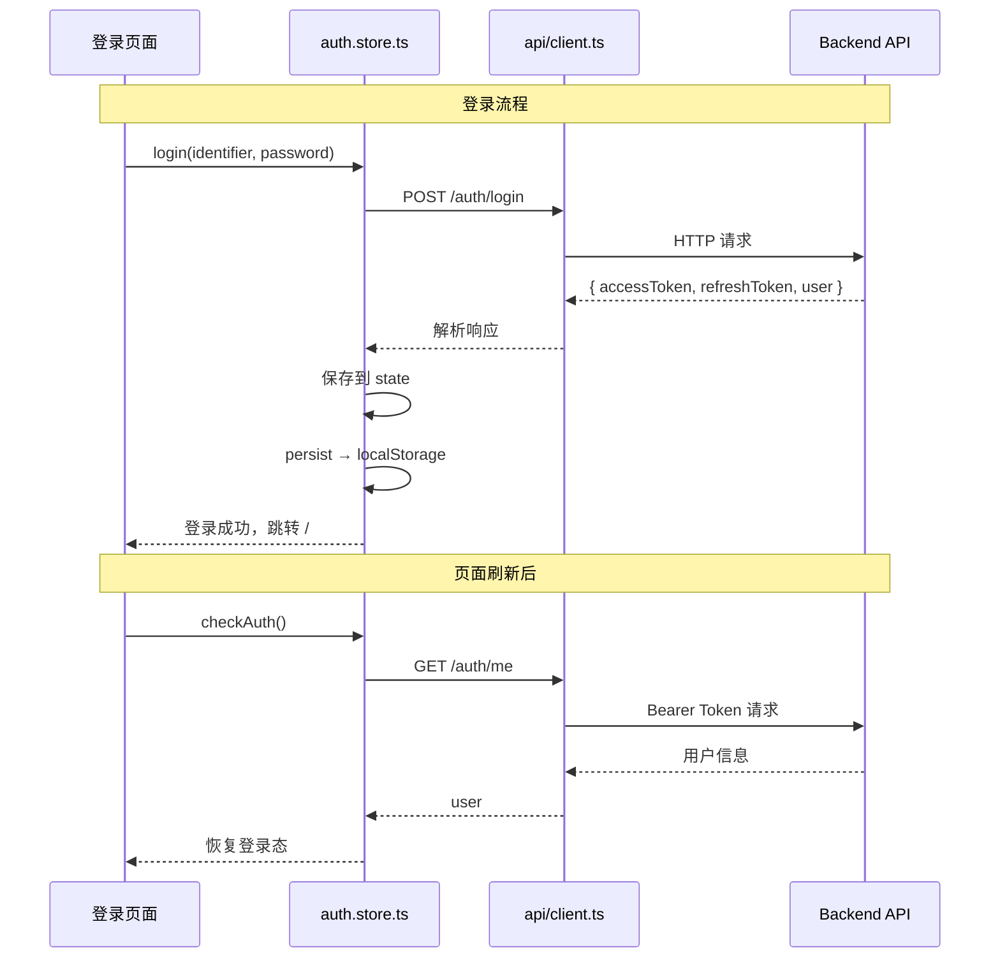
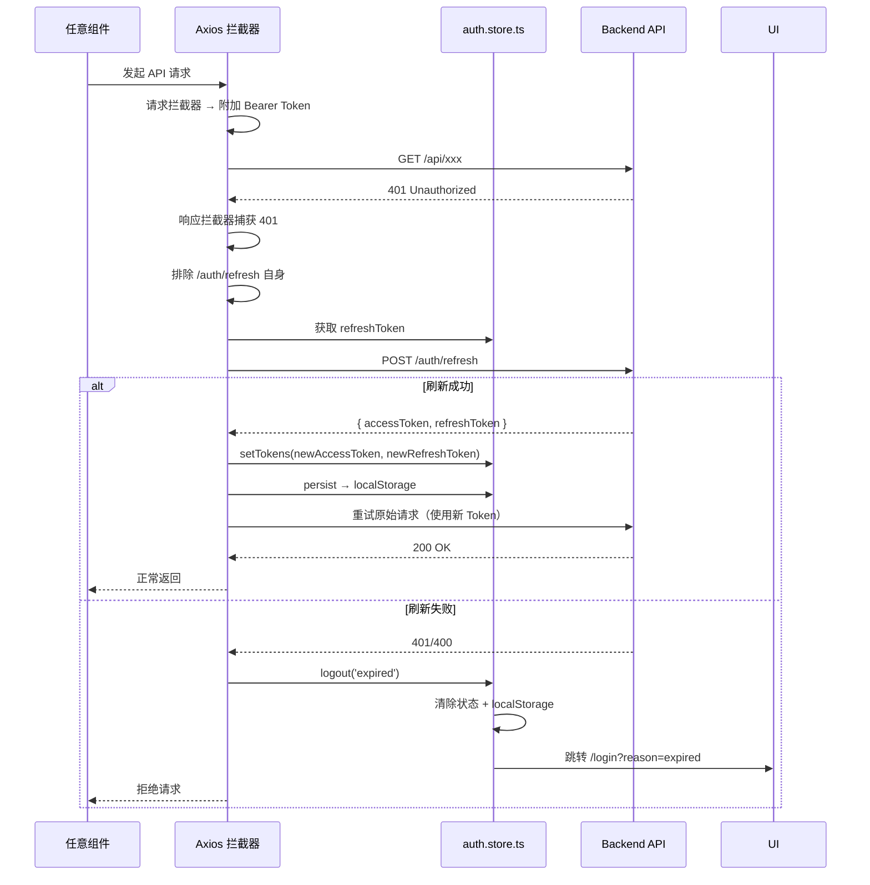
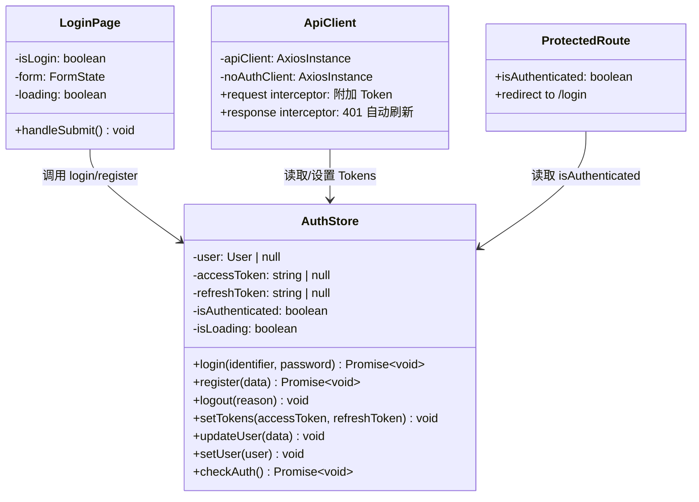
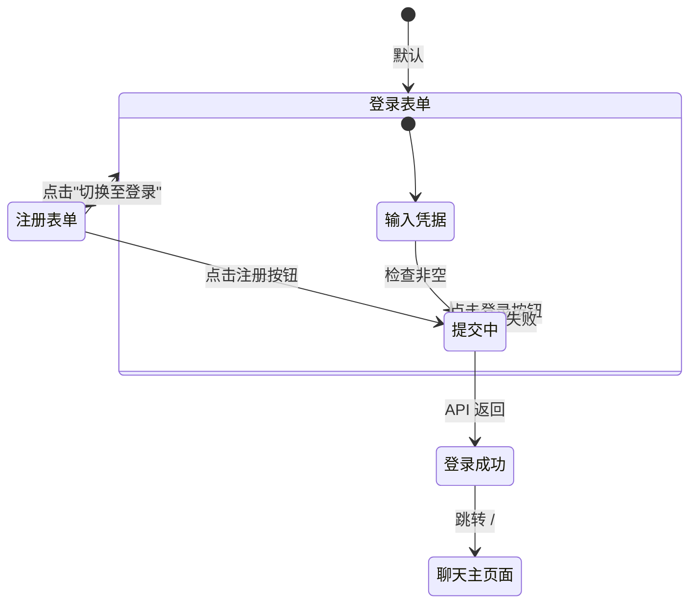

# 前端认证流程与状态管理

## 1. 功能概述

### 有什么用？

认证模块管理用户的**登录态、Token 生命周期**和**全局用户状态**。它通过 Zustand 持久化存储 + Axios 拦截器 + 路由守卫三层机制，确保用户在整个应用中的身份状态一致、安全可靠。

### 如何使用？

| 功能 | 交互方式 | 说明 |
|------|---------|------|
| 登录 | 用户名/邮箱 + 密码表单提交 | 调用 `authStore.login()` |
| 注册 | 填写用户名、邮箱、密码 | 调用 `authStore.register()` |
| OAuth 登录 | 点击 GitHub/Google 按钮 | 跳转 OAuth 授权页 → 回调自动登录 |
| 登出 | 点击退出按钮 | 清除 Store + 跳转登录页 |
| 自动刷新 | 透明处理 | Axios 拦截器自动刷新 Token，用户无感知 |

### 为什么要有这个功能？

- **状态持久化**：Zustand `persist` 中间件将 Token 存入 localStorage，页面刷新后不丢失
- **自动续期**：401 拦截器自动刷新 Access Token，避免用户频繁重新登录
- **全局可用**：`useAuthStore` 可在任意组件中获取当前用户信息，无需 props 层层传递

---

## 2. 架构设计

### 认证数据流



### Token 自动刷新流程



### 模块类图



---

## 3. 核心代码解释

### 3.1 Zustand Store 定义

```typescript
// auth.store.ts — 认证状态管理
import { create } from 'zustand'
import { persist } from 'zustand/middleware'

interface AuthState {
  user: User | null
  accessToken: string | null
  refreshToken: string | null
  isAuthenticated: boolean
  isLoading: boolean
  login: (identifier: string, password: string) => Promise<void>
  register: (data: RegisterDTO) => Promise<void>
  logout: (reason?: 'expired' | 'manual') => void
  setTokens: (accessToken: string, refreshToken: string) => void
  checkAuth: () => Promise<void>
}

export const useAuthStore = create<AuthState>()(
  persist(
    (set, get) => ({
      user: null,
      accessToken: null,
      refreshToken: null,
      isAuthenticated: false,
      isLoading: false,

      login: async (identifier, password) => {
        const { user, accessToken, refreshToken } = await authApi.login({
          identifier,
          password,
        })
        set({ user, accessToken, refreshToken, isAuthenticated: true })
      },

      logout: (reason) => {
        const { refreshToken } = get()
        authApi.logout(refreshToken).catch(() => {})
        set({
          user: null,
          accessToken: null,
          refreshToken: null,
          isAuthenticated: false,
        })
        window.location.href = `/login${reason === 'expired' ? '?reason=expired' : ''}`
      },
    }),
    {
      name: 'auth-storage',  // localStorage key
      partialize: (state) => ({
        user: state.user,
        accessToken: state.accessToken,
        refreshToken: state.refreshToken,
        isAuthenticated: state.isAuthenticated,
      }),
    },
  ),
)
```

**设计意图**：`persist` 中间件自动将选中字段同步到 localStorage。`partialize` 控制只序列化数据字段，排除 `isLoading` 和函数。

### 3.2 Axios 拦截器

```typescript
// api/client.ts — Token 拦截器与自动刷新
const apiClient = axios.create({
  baseURL: import.meta.env.VITE_API_URL || '/api/v1',
  timeout: 30000,
})

// 请求拦截器：自动附加 Token
apiClient.interceptors.request.use((config) => {
  const token = useAuthStore.getState().accessToken
  if (token) {
    config.headers.Authorization = `Bearer ${token}`
  }
  return config
})

// 响应拦截器：401 自动刷新
let isRefreshing = false
let pendingRequests: Array<(token: string) => void> = []

apiClient.interceptors.response.use(
  (response) => response.data,  // 自动解包 data
  async (error) => {
    if (error.response?.status !== 401 || error.config.url === '/auth/refresh') {
      return Promise.reject(error)
    }

    if (!isRefreshing) {
      isRefreshing = true
      try {
        const { refreshToken } = useAuthStore.getState()
        const tokens = await noAuthClient.post('/auth/refresh', { refreshToken })
        useAuthStore.getState().setTokens(tokens.accessToken, tokens.refreshToken)

        // 重放等待队列中的请求
        pendingRequests.forEach(cb => cb(tokens.accessToken))
        pendingRequests = []

        // 重试当前请求
        error.config.headers.Authorization = `Bearer ${tokens.accessToken}`
        return apiClient(error.config)
      } catch {
        useAuthStore.getState().logout('expired')
        return Promise.reject(error)
      } finally {
        isRefreshing = false
      }
    } else {
      // 已在刷新中，排队等待
      return new Promise((resolve) => {
        pendingRequests.push((token: string) => {
          error.config.headers.Authorization = `Bearer ${token}`
          resolve(apiClient(error.config))
        })
      })
    }
  },
)
```

**设计意图**：
- **请求拦截器**：从 Store 读取 Token，不依赖组件 props
- **响应拦截器 auto-unwrap**：直接返回 `response.data`，调用方无需重复 `.data`
- **刷新队列**：多个请求同时遇到 401 时，只发一次刷新请求，其余排队等待新 Token

### 3.3 路由守卫

```typescript
// App.tsx — 受保护路由组件
function ProtectedRoute({ children }: { children: React.ReactNode }) {
  const isAuthenticated = useAuthStore((s) => s.isAuthenticated)

  if (!isAuthenticated) {
    return <Navigate to="/login" replace />
  }
  return <>{children}</>
}

// 路由配置
<Routes>
  <Route path="/login" element={<LoginPage />} />
  <Route
    path="/"
    element={
      <ProtectedRoute>
        <ChatLayout />
      </ProtectedRoute>
    }
  >
    <Route path="chat" element={<PrivateChatPage />} />
    <Route path="chat/:sessionId" element={<PrivateChatPage />} />
    <Route path="agent" element={<EnhancedAgentPage />} />
    <Route path="settings" element={<SettingsPage />} />
  </Route>
</Routes>
```

---

## 4. 登录页面交互流程



---

## 5. 技术要点

| 要点 | 实现 | 说明 |
|------|------|------|
| 状态持久化 | zustand/middleware/persist | 刷新后保持登录态 |
| Token 安全 | 仅存 accessToken + refreshToken | 密码等敏感信息不落地 |
| 并发刷新 | 请求队列 + isRefreshing 锁 | 避免多次刷新请求 |
| 类型安全 | TypeScript 接口定义完整状态 | IDE 智能提示 |
| API 分离 | apiClient / noAuthClient | 登录注册不走 Token 拦截器 |
