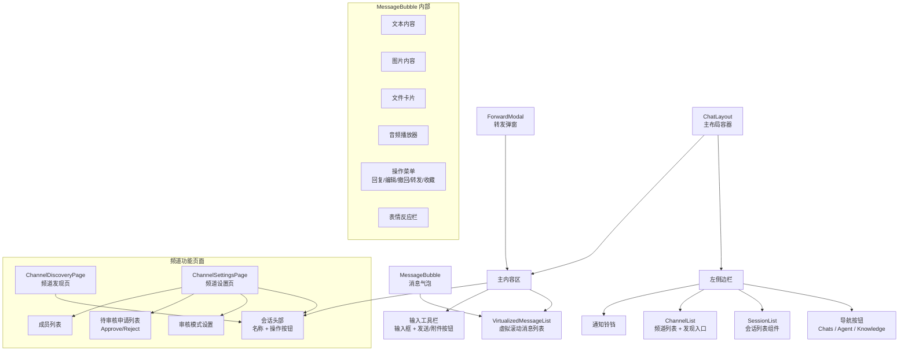
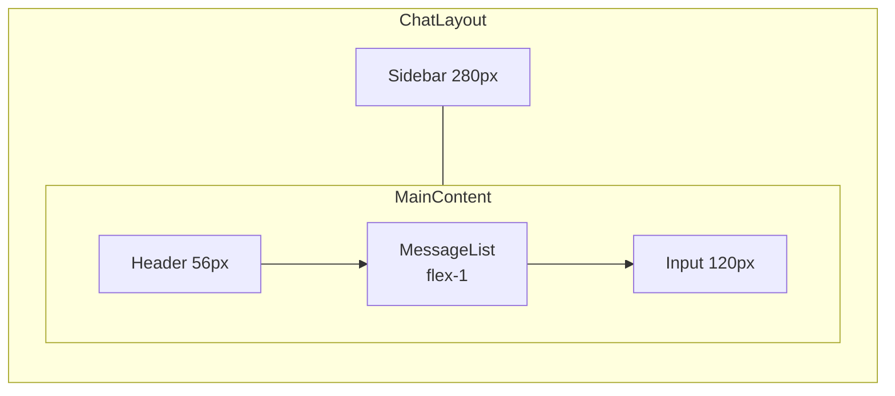
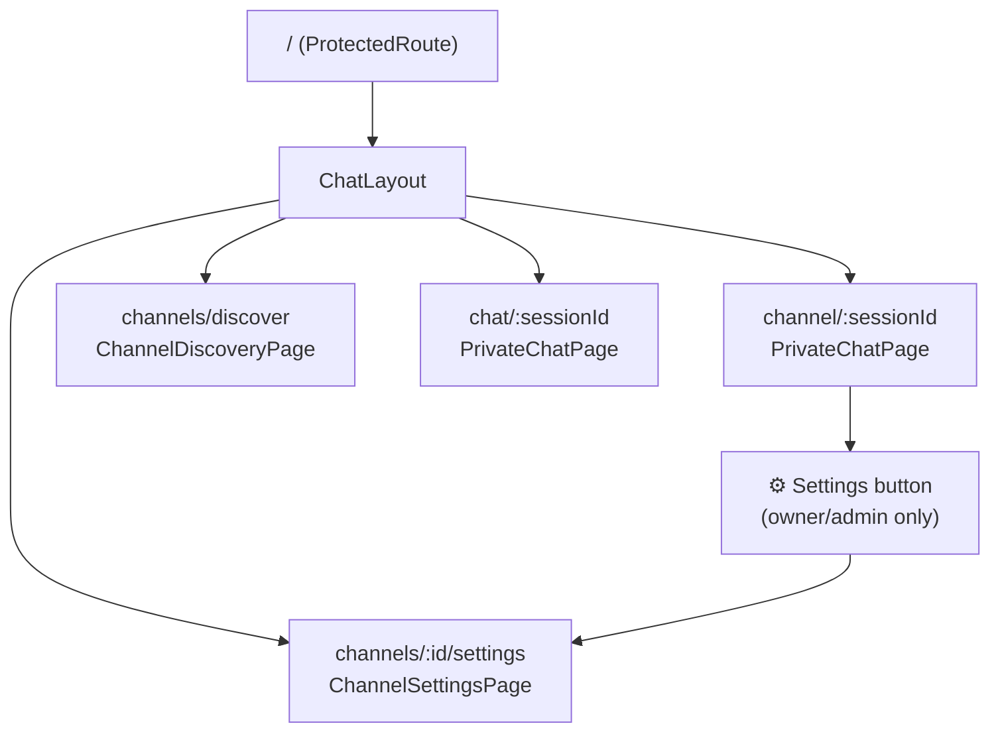
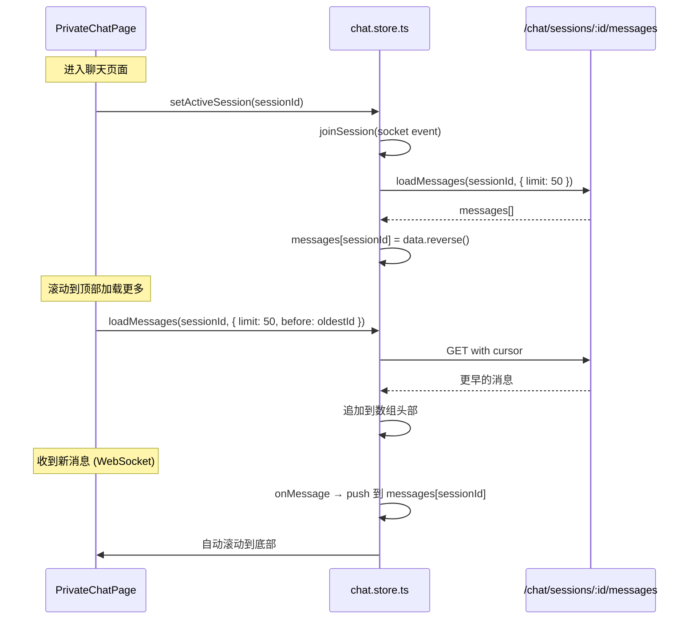
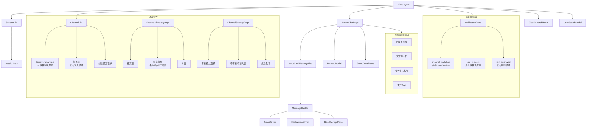
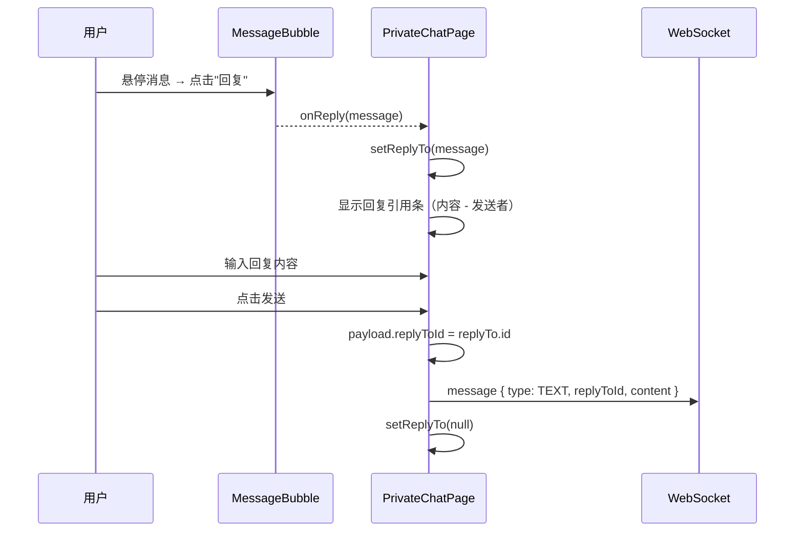
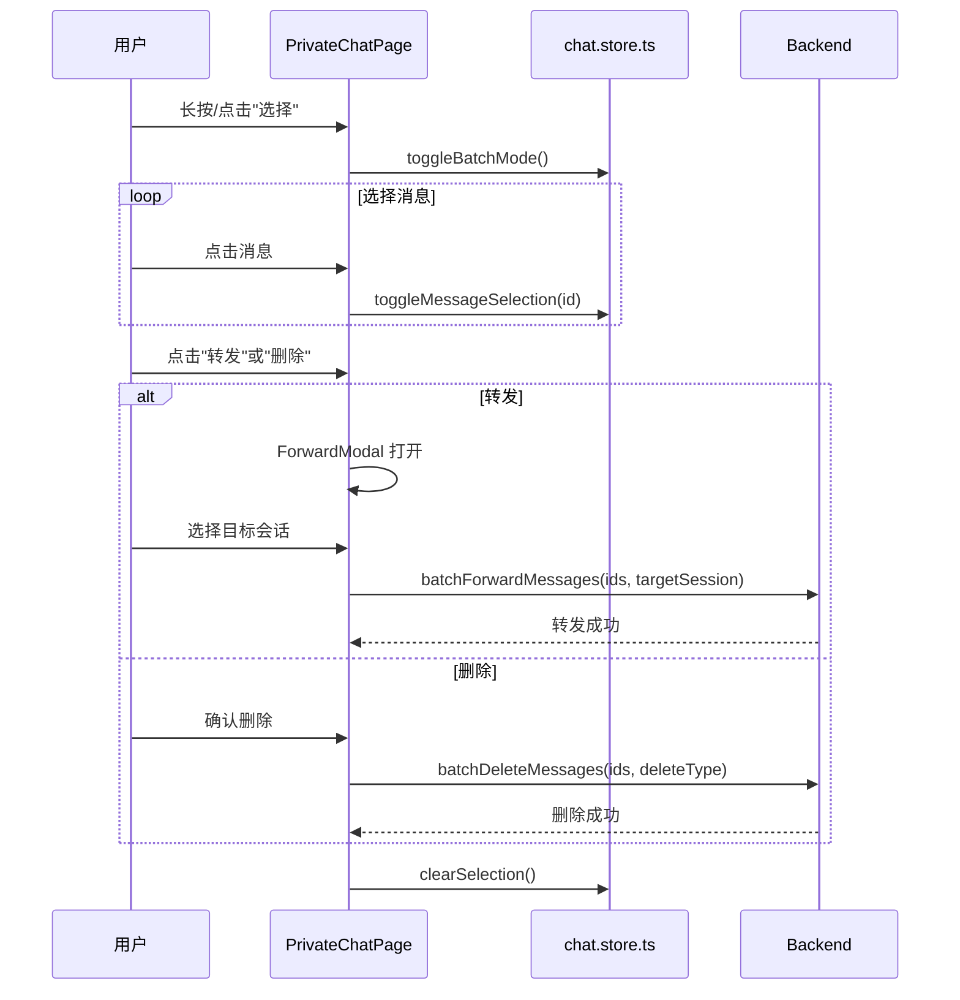
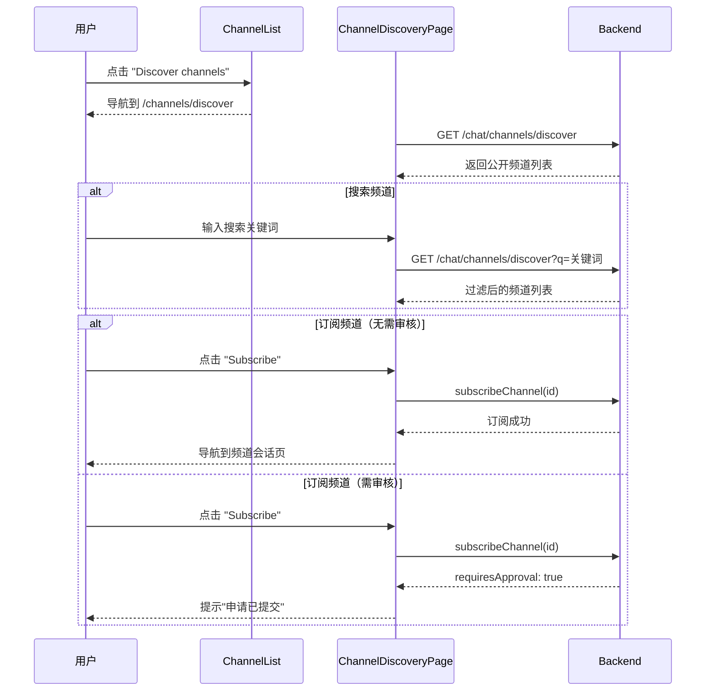
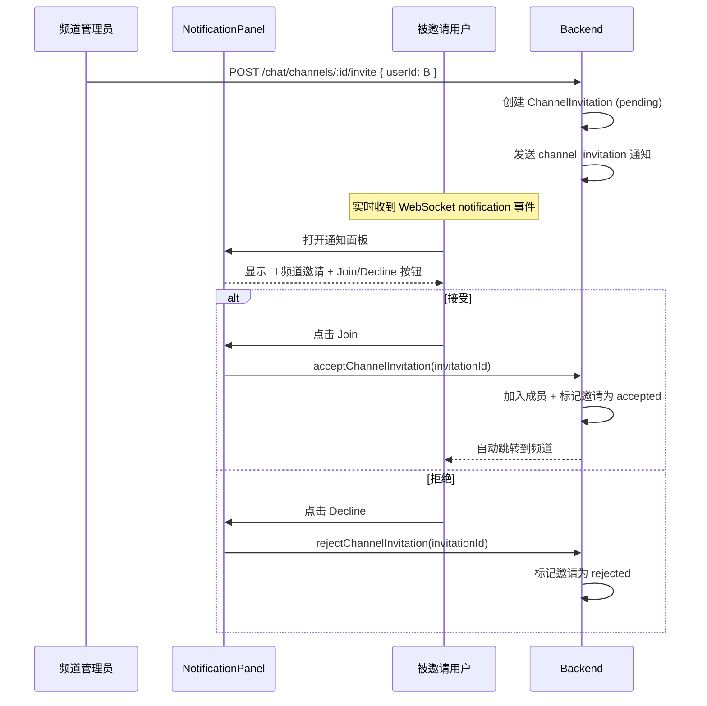
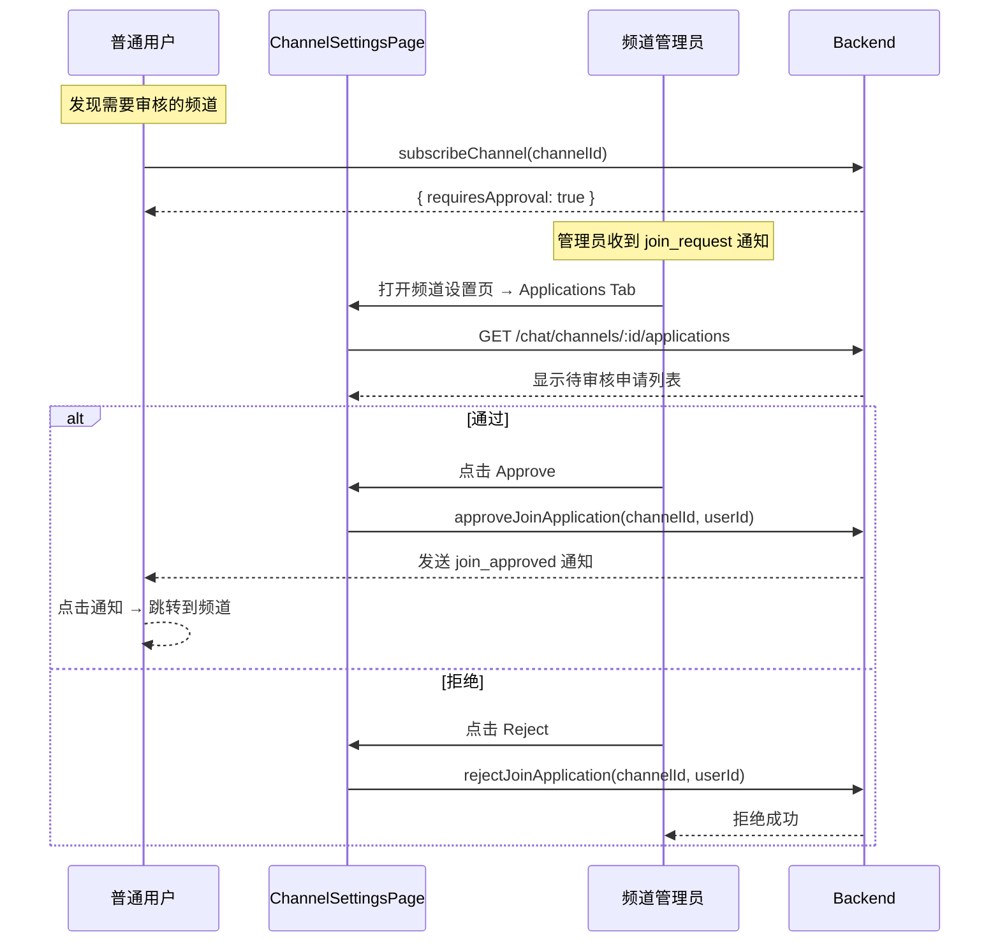

# 前端聊天界面

## 1. 功能概述

### 有什么用？

聊天界面是本系统的核心用户交互区域，提供**会话管理、消息展示、消息输入**、**丰富交互操作**和**频道(Channel)社交功能**。它在 `ChatLayout` 的骨架内渲染，通过 `PrivateChatPage` 承载具体聊天内容。

频道功能包括：**频道发现**（浏览公开频道）、**频道邀请**（直接邀请用户）、**加入审核**（申请/审批流程）。

### 核心能力

| 功能 | 使用方式 | 说明 |
|------|---------|------|
| 会话列表 | 左侧边栏展示 | 展示所有会话，按置顶+时间排序 |
| 消息浏览 | 虚拟滚动列表 | 支持上下滚动，自动滚动到最新 |
| 文本消息 | 输入框输入 + Enter 发送 | 纯文本消息 |
| 图片消息 | 拖拽/选择图片文件 | 上传后以图片形式展示 |
| 文件消息 | 选择文件上传 | 展示文件卡片（名称、大小） |
| 消息回复 | 悬停菜单 → 回复 | 在输入区上方显示回复引用 |
| 消息编辑 | 悬停菜单 → 编辑 | 15 分钟内可编辑，替换为编辑模式 |
| 消息撤回 | 悬停菜单 → 撤回 | 5 分钟内可撤回 |
| 消息转发 | 悬停菜单 → 转发 | 支持单条/批量转发 |
| 消息收藏 | 悬停菜单 → 收藏 | 收藏后可统一查看 |
| 表情反应 | 悬停菜单 → 表情 | Emoji 选择器添加反应 |
| 已读回执 | 点击已读按钮 | 展示已读/未读成员列表 |
| @提及 | 输入 @ 触发 | @all/@everyone 高亮 |
| 正在输入 | 对方输入时显示 | 实时状态展示 |
| 批量操作 | 进入批量模式 | 选择多条消息后转发/删除 |
| **频道发现** | 侧边栏 → Discover channels | 浏览/搜索公开频道并订阅 |
| **频道邀请** | 通知面板 → 接受/拒绝 | 收到邀请通知后可操作 |
| **加入审核** | 频道设置 → 审核模式 | 管理加入申请 |

### 为什么要有这个功能？

- **沉浸式聊天体验**：虚拟滚动 + 自动滚动 + 输入状态，接近原生 IM 应用
- **丰富消息类型**：图文文件音视频全覆盖，满足各类沟通场景
- **消息掌控力**：编辑、撤回、转发、收藏、批量操作，用户对消息有完整控制权
- **社交反馈**：表情反应和已读回执提供即时社交反馈
- **频道社交**：发现频道、邀请加入、审核管理，形成完整的频道社交生态

---

## 2. UI 架构

### 页面组件结构



### 聊天页面布局



### 频道功能路由结构



---

## 3. 核心代码解释

### 3.1 聊天 Store

```typescript
// chat.store.ts — 聊天状态管理
interface ChatState {
  sessions: ChatSession[]
  activeSessionId: string | null
  messages: Record<string, ChatMessage[]>
  onlineUsers: Set<string>
  typingUsers: Record<string, { userId: string; username: string }[]>
  socket: Socket | null
  batchMode: boolean
  selectedMessageIds: Set<string>

  // 核心方法
  connect: (token: string) => void
  disconnect: () => void
  sendMessage: (sessionId: string, content: string, contentType?: MessageType) => void
  loadMessages: (sessionId: string, params?: QueryMessagesDto) => Promise<void>
  editMessage: (sessionId: string, messageId: string, content: string) => Promise<void>
  createSession: (data: CreateSessionDto) => Promise<string>
  setActiveSession: (sessionId: string | null) => void
  toggleBatchMode: () => void
}
```

### 3.2 消息发送处理

```typescript
// PrivateChatPage.tsx — 消息发送
const handleSend = () => {
  if (!input.trim()) return

  // 回复模式：附加 replyToId
  const payload: any = {
    sessionId,
    content: input,
    type: WsMessageType.TEXT,
  }

  if (replyTo) {
    payload.replyToId = replyTo.id
  }

  // 通过 WebSocket 发送
  sendMessage(sessionId, input)

  // 清除输入和回复引用
  setInput('')
  setReplyTo(null)

  // 清除输入状态
  if (typingTimeoutRef.current) {
    clearTimeout(typingTimeoutRef.current)
  }
  sendTyping(sessionId, false)
}
```

### 3.3 虚拟消息列表



### 3.4 消息气泡渲染

```tsx
// MessageBubble.tsx — 消息渲染
const MessageBubble: FC<MessageBubbleProps> = ({ message, isOwn, ...handlers }) => {
  const content = useMemo(() => {
    if (message.isRecalled) {
      return <span className="italic text-gray-400">已撤回</span>
    }

    switch (message.contentType) {
      case 'image':
        return <LazyImage src={message.metadata?.url} alt="图片" />

      case 'file':
        return (
          <div className="file-card">
            <FileIcon />
            <span>{message.metadata?.fileName}</span>
            <span className="text-xs">{formatFileSize(message.metadata?.fileSize)}</span>
          </div>
        )

      case 'audio':
        return <audio controls src={message.metadata?.url} />

      case 'ai_response':
        return <StreamingMarkdown content={message.content} />

      default:
        return <>{renderContentWithMentions(message.content)}</>
    }
  }, [message.contentType, message.content, message.isRecalled])

  return (
    <div className={`message-bubble ${isOwn ? 'own' : 'other'}`}>
      {message.replyTo && (
        <div className="reply-preview">@{message.replyTo.sender?.username}: {message.replyTo.content}</div>
      )}
      {content}
      {message.editCount > 0 && <span className="edited-tag">已编辑</span>}
      <ReactionsBar reactions={message.reactions} onAdd={handlers.onReaction} />
    </div>
  )
}
```

**设计意图**：通过 `useMemo` 根据消息类型缓存渲染结果；`contentType` 分支覆盖所有消息类型。

### 3.5 输入中状态（Typing Indicator）

```typescript
// PrivateChatPage.tsx — 输入状态管理
const handleInputChange = (value: string) => {
  setInput(value)

  // 发送 typing 信号
  if (!typingTimeoutRef.current) {
    sendTyping(sessionId, true)
  }

  // 2 秒后自动清除 typing 状态
  if (typingTimeoutRef.current) {
    clearTimeout(typingTimeoutRef.current)
  }
  typingTimeoutRef.current = setTimeout(() => {
    sendTyping(sessionId, false)
    typingTimeoutRef.current = null
  }, 2000)
}
```

---

## 4. 组件树



---

## 5. 关键交互流程

### 消息回复



### 批量操作



### 频道发现流程



### 频道邀请流程



### 加入审核流程



---

## 6. 技术要点

| 特性 | 实现方案 | 说明 |
|------|---------|------|
| 消息列表 | react-window 虚拟滚动 | 仅渲染可视区域消息，大量消息不卡顿 |
| 消息存储 | `Record<string, ChatMessage[]>` | 按 sessionId 分片存储 |
| 自动滚动 | IntersectionObserver + scrollTo | 新消息自动滚到底部 |
| 编辑模式 | 替换输入框为编辑模式 | 复用现有输入逻辑 |
| 批量模式 | Set 管理选中 ID | 增删改查 O(1) |
| 乐观更新 | 本地先更新状态 | 表情反应等操作 UI 即时反馈 |
| **频道发现** | 独立页面 ChannelDiscoveryPage | 卡片布局 + 搜索 + 分页 |
| **频道设置** | 独立页面 ChannelSettingsPage | 三 Tab：设置/申请/成员 |
| **通知集成** | NotificationPanel 内联按钮 | channel_invitation 显示 Join/Decline |
| **审核通知** | 点击跳转对应页面 | join_request → 设置页, join_approved → 频道 |
| **访问入口** | 频道头部⚙️齿轮按钮 | 仅 owner/admin 可见 |

## 7. 频道访问控制对照表

| 审核模式 | 订阅行为 | 前端显示 | 邀请 |
|---------|---------|---------|------|
| `none`（直接加入） | `subscribeChannel` → 直接成为成员 | 显示 "Subscribe" 按钮 | ✅ |
| `approval`（需审核） | `subscribeChannel` → 创建申请 → 通知管理员 | 显示 "Apply to Join"，按钮变为待审核状态 | ✅ |
| `invite_only`（仅邀请） | `subscribeChannel` → 抛出 ForbiddenException | 不显示订阅按钮，只显示 "Invite only" 标签 | ✅ |
