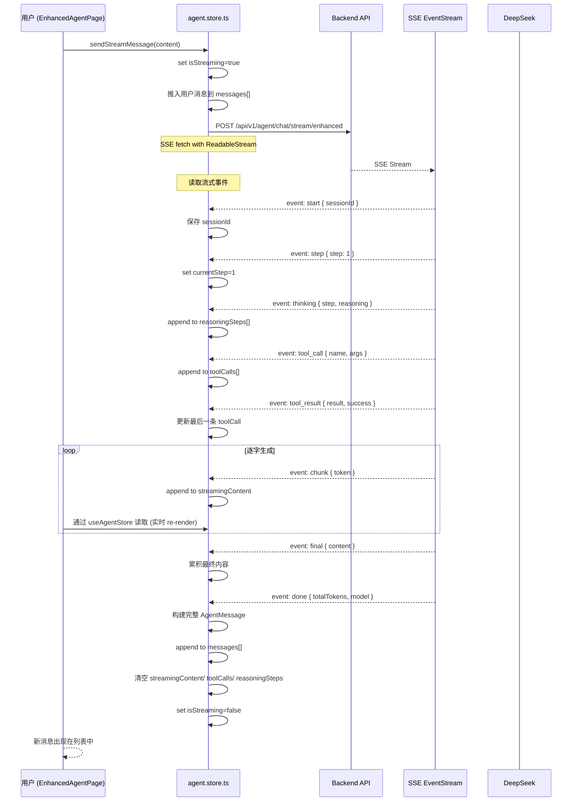
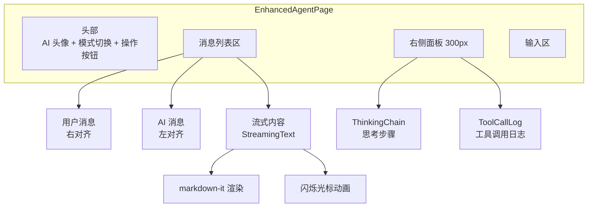
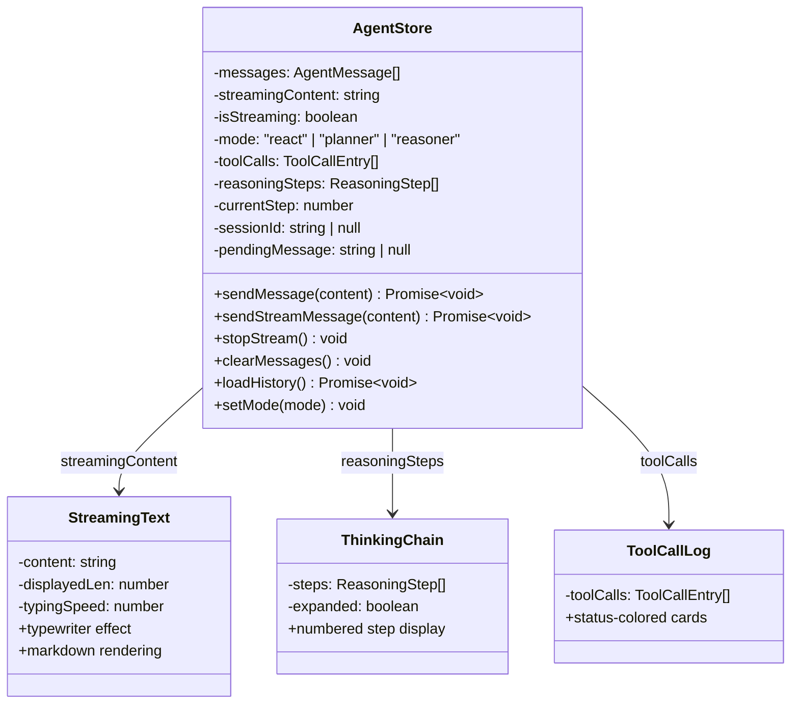
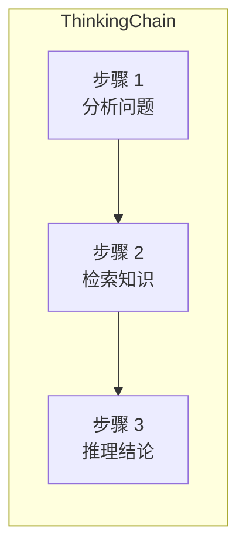

# 前端 AI 对话页面

## 1. 功能概述

### 有什么用？

AI 对话页面是用户与 AI Agent 交互的界面，支持**三种推理模式**切换、**流式文本逐字输出**、**思维链展示**和**工具调用日志**。它让用户在使用 AI 时拥有完全透明的体验，能看到 AI 的"思考过程"。

### 如何使用？

| 功能 | 交互方式 | 说明 |
|------|---------|------|
| 发送消息 | 输入框输入 + Enter | 支持 Shift+Enter 换行 |
| 模式切换 | 下拉选择 react/planner/reasoner | 切换 AI 推理模式 |
| 流式输出 | 自动 | AI 回复逐字展示，带光标动画 |
| 思考链 | 点击"显示思考"按钮 | 展开/收起 AI 推理步骤 |
| 工具日志 | 点击"显示工具调用"按钮 | 查看 AI 调用了哪些工具 |
| 清空对话 | 点击"清空历史"按钮 | 清除当前对话和短期记忆 |

### 为什么要有这个功能？

- **透明可信**：流式输出 + 思考链 + 工具日志，让 AI 的推理过程完全可见
- **灵活切换**：三种推理模式覆盖不同场景（快速问答 / 复杂任务 / 深度推理）
- **沉浸体验**：打字机效果 + 实时更新，降低等待焦虑
- **可调试**：工具调用日志帮助用户理解 AI 如何获取信息

---

## 2. 架构设计

### 流式数据传输流程



### 页面组件结构



### 状态管理



---

## 3. 核心代码解释

### 3.1 SSE 流式读取

```typescript
// agent.store.ts — SSE 流式消息处理
sendStreamMessage: async (content: string) => {
  const state = get()

  // 防重复提交
  if (state.pendingMessage === content) return
  set({ pendingMessage: content })

  // 推入用户消息
  set((s) => ({
    messages: [...s.messages, { role: 'user', content }],
    streamingContent: '',
    isStreaming: true,
    toolCalls: [],
    reasoningSteps: [],
    currentStep: 0,
    error: null,
  }))

  try {
    const token = useAuthStore.getState().accessToken
    const response = await fetch(`/api/v1/agent/chat/stream/enhanced`, {
      method: 'POST',
      headers: { Authorization: `Bearer ${token}`, 'Content-Type': 'application/json' },
      body: JSON.stringify({ message: content, mode: get().mode, sessionId: get().sessionId }),
    })

    const reader = response.body!.getReader()
    const decoder = new TextDecoder()
    let buffer = ''

    while (true) {
      const { done, value } = await reader.read()
      if (done) break

      buffer += decoder.decode(value, { stream: true })
      const lines = buffer.split('\n')
      buffer = lines.pop() || ''

      for (const line of lines) {
        if (!line.startsWith('data: ')) continue
        const event = JSON.parse(line.slice(6))

        switch (event.type) {
          case 'start':
            set({ sessionId: event.data.sessionId })
            break

          case 'chunk':
            set((s) => ({ streamingContent: s.streamingContent + event.data }))
            break

          case 'thinking':
          case 'reasoning':
            set((s) => ({
              reasoningSteps: [...s.reasoningSteps, event.data],
            }))
            break

          case 'tool_call':
            set((s) => ({
              toolCalls: [...s.toolCalls, {
                name: event.data.tool,
                args: event.data.input,
                status: 'running',
                timestamp: Date.now(),
              }],
            }))
            break

          case 'tool_result':
            set((s) => {
              const calls = [...s.toolCalls]
              const last = calls[calls.length - 1]
              if (last) {
                last.result = event.data.output
                last.success = event.data.status === 'success'
              }
              return { toolCalls: calls }
            })
            break

          case 'final':
            set((s) => ({ streamingContent: s.streamingContent + event.data }))
            break

          case 'done':
            const finalContent = get().streamingContent
            const finalMessage: AgentMessage = {
              role: 'assistant',
              content: finalContent,
              metadata: {
                reasoning: get().reasoningSteps,
                toolCalls: get().toolCalls,
                model: event.data.model,
                totalTokens: event.data.totalTokens,
              },
            }
            set((s) => ({
              messages: [...s.messages, finalMessage],
              streamingContent: '',
              isStreaming: false,
              pendingMessage: null,
            }))
            break
        }
      }
    }
  } catch (err: any) {
    set({ error: err.message, isStreaming: false, pendingMessage: null })
  }
}
```

**设计意图**：
- **防重复提交**：`pendingMessage` 保护，防止快速点击发送相同内容
- **buffer 累积**：SSE 数据可能跨 chunk 截断，buffer 确保每行完整
- **增量更新**：每条数据到达立即 setState，React 自动 re-render
- **最终组装**：`done` 事件时将流式内容组装为完整消息存入历史

### 3.2 打字机效果组件

```tsx
// StreamingText.tsx — 打字机效果
const StreamingText: FC<StreamingTextProps> = ({
  content,
  typingSpeed = 8,
  isStreaming = false,
}) => {
  const [displayedLen, setDisplayedLen] = useState(0)
  const contentRef = useRef(content)
  const typingRef = useRef<number>()

  useEffect(() => {
    contentRef.current = content

    if (isStreaming) {
      // 打字机效果：每 typingSpeed ms 多显示一个字符
      const tick = () => {
        typingRef.current = window.setTimeout(() => {
          setDisplayedLen((prev) => {
            if (prev < contentRef.current.length) {
              tick()
              return prev + 1
            }
            return prev
          })
        }, typingSpeed)
      }
      tick()
    } else {
      // 流式结束：瞬间显示全部
      setDisplayedLen(content.length)
    }

    return () => clearTimeout(typingRef.current)
  }, [isStreaming, typingSpeed])

  const html = useMemo(
    () => markdownit.render(content.slice(0, displayedLen)),
    [content, displayedLen],
  )

  return (
    <div className="streaming-text">
      <div dangerouslySetInnerHTML={{ __html: html }} />
      {isStreaming && displayedLen < content.length && (
        <span className="cursor animate-pulse">▍</span>
      )}
    </div>
  )
}
```

**设计意图**：打字机效果通过递归 `setTimeout` 控制显示进度。流式结束后立刻展示全文，避免用户等待。`animate-pulse` 光标指示正在生成中。

### 3.3 模式选择与消息发送

```tsx
// EnhancedAgentPage.tsx — 主要逻辑
const EnhancedAgentPage = () => {
  const {
    messages, streamingContent, isStreaming,
    reasoningSteps, toolCalls,
    streamMessage, clearHistory,
  } = useAgentStore()

  const [input, setInput] = useState('')
  const [mode, setMode] = useState<'react' | 'planner' | 'reasoner'>('react')
  const [showThinking, setShowThinking] = useState(true)
  const [showTools, setShowTools] = useState(true)

  const handleSend = () => {
    if (!input.trim() || isStreaming) return
    streamMessage(input, mode)
    setInput('')
  }

  const handleKeyDown = (e: React.KeyboardEvent) => {
    if (e.key === 'Enter' && !e.shiftKey) {
      e.preventDefault()
      handleSend()
    }
  }

  return (
    <div className="agent-layout">
      {/* 头部 */}
      <header>
        <h2>AI 助手</h2>
        <select value={mode} onChange={e => setMode(e.target.value as any)}>
          <option value="react">快速响应 (ReAct)</option>
          <option value="planner">计划执行 (Planner)</option>
          <option value="reasoner">深度推理 (Reasoner)</option>
        </select>
        <button onClick={clearHistory}>清空历史</button>
      </header>

      {/* 消息列表 */}
      <div className="messages">
        {messages.map((msg, i) => (
          <div key={i} className={`message ${msg.role}`}>
            {msg.content}
          </div>
        ))}
        {streamingContent && (
          <div className="message assistant">
            <StreamingText content={streamingContent} isStreaming />
          </div>
        )}
      </div>

      {/* 右侧面板 */}
      <aside className="side-panel">
        <details open={showThinking}>
          <summary>思考链</summary>
          <ThinkingChain />
        </details>
        <details open={showTools}>
          <summary>工具调用</summary>
          <ToolCallLog />
        </details>
      </aside>

      {/* 输入区 */}
      <footer>
        <textarea
          value={input}
          onChange={e => setInput(e.target.value)}
          onKeyDown={handleKeyDown}
          disabled={isStreaming}
          placeholder="输入消息... (Enter 发送, Shift+Enter 换行)"
        />
        <button onClick={handleSend} disabled={isStreaming}>发送</button>
      </footer>
    </div>
  )
}
```

---

## 4. 组件详解

### ThinkingChain 思考链



显示 AI 的每个推理步骤，带编号和内容。折叠/展开功能让用户自主选择是否查看。

### ToolCallLog 工具调用日志

| 工具状态 | 颜色 | 说明 |
|---------|------|------|
| 运行中 | 黄色边框 | 工具正在执行 |
| 成功 | 绿色边框 | 工具返回结果 |
| 失败 | 红色边框 | 工具调用出错 |

---

## 5. 关键设计决策

| 决策 | 选择 | 原因 |
|------|------|------|
| 传输协议 | Server-Sent Events | 单向流式传输，比 WebSocket 更轻量 |
| 事件格式 | 结构化 JSON 事件 | 前端可按 type 分发处理，逻辑清晰 |
| 打字机效果 | setTimeout 递归 | 可控字符速率，比 CSS 动画更精确 |
| 状态管理 | 单一 Zustand Store | 多个组件共享流式状态，避免 props drilling |
| 防重复 | pendingMessage 锁 | 防止快速点击产生重复请求 |
| Markdown 渲染 | markdown-it | 成熟稳定，支持代码高亮扩展 |
