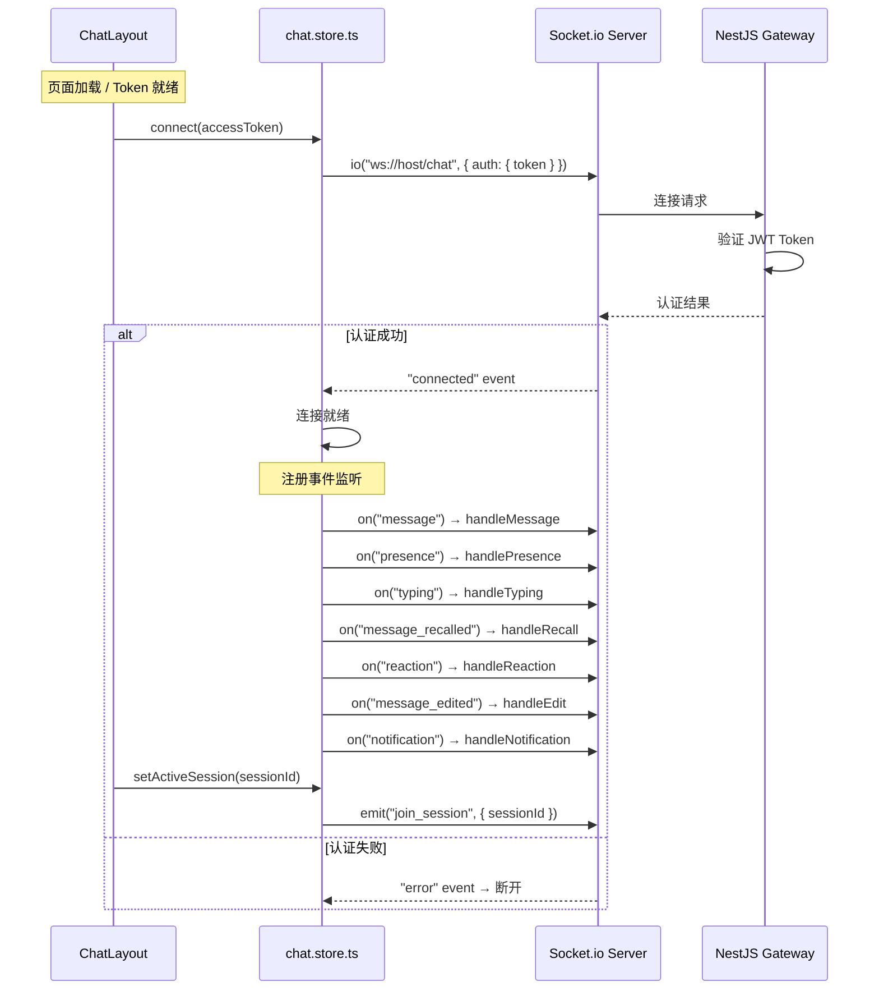
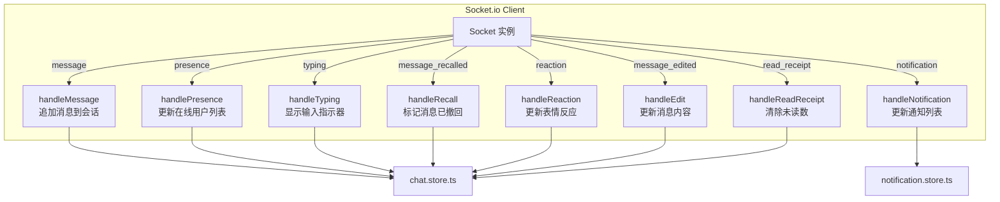
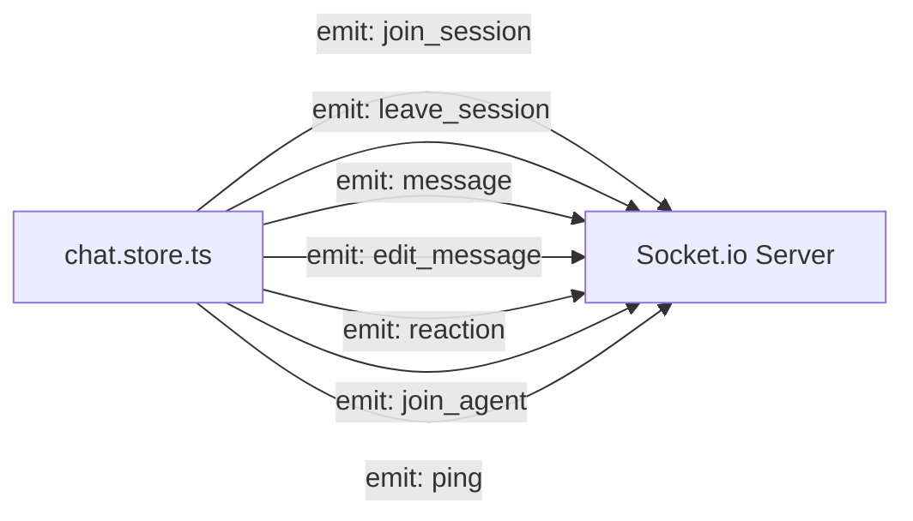
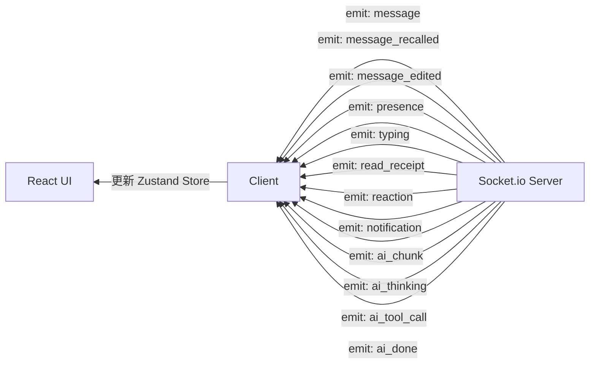

# 前端实时通信客户端

## 1. 功能概述

### 有什么用？

实时通信客户端基于 Socket.io-client 实现，是前端与后端之间**实时双向通信的通道**。它负责消息的**即时收发**、**在线状态同步**、**输入状态广播**、**已读回执**和 **AI 流式响应**等所有实时功能，让用户获得无延迟的聊天体验。

### 如何使用？

无需手动操作，`ChatLayout` 组件在加载时自动建立 WebSocket 连接：

```typescript
// ChatLayout.tsx — 自动连接
useEffect(() => {
  if (accessToken) {
    connect(accessToken)  // 连接 WebSocket
    loadSessions()        // 加载会话列表
  }
}, [accessToken])
```

### 为什么要有这个功能？

- **零延迟通信**：WebSocket 持久连接避免了 HTTP 轮询的延迟和开销
- **服务器推送**：新消息、@提及、系统通知等服务器主动推送，无需客户端轮询
- **状态同步**：在线状态、输入状态等即时变化需要双向实时通道
- **AI 实时流式输出**：AI 回复逐字推送，降低等待焦虑

---

## 2. 架构设计

### WebSocket 连接管理



### 事件处理映射



---

## 3. 核心代码解释

### 3.1 Socket 初始化与事件注册

```typescript
// chat.store.ts — WebSocket 连接与事件监听
connect: (token: string) => {
  // 断开旧连接
  get().socket?.disconnect()

  const socket = io(`${import.meta.env.VITE_WS_URL || ''}/chat`, {
    auth: { token },
    transports: ['websocket', 'polling'],  // 首选 WebSocket，降级到 polling
  })

  socket.on('connect', () => {
    console.log('WebSocket connected')
  })

  // === 消息事件 ===
  socket.on('message', (message: ChatMessage) => {
    set((state) => {
      const sessionMessages = state.messages[message.sessionId] || []
      const isActive = state.activeSessionId === message.sessionId

      return {
        messages: {
          ...state.messages,
          [message.sessionId]: [...sessionMessages, message],
        },
        sessions: state.sessions.map((s) =>
          s.id === message.sessionId
            ? { ...s, lastMessage: message, unreadCount: isActive ? s.unreadCount : s.unreadCount + 1 }
            : s
        ),
      }
    })
  })

  // === 在线状态 ===
  socket.on('presence', ({ userId, status }) => {
    set((state) => {
      const updated = new Set(state.onlineUsers)
      if (status === 'online') updated.add(userId)
      else updated.delete(userId)
      return { onlineUsers: updated }
    })
  })

  // === 输入状态 ===
  socket.on('typing', ({ sessionId, userId, username, isTyping }) => {
    set((state) => {
      const current = state.typingUsers[sessionId] || []
      const filtered = current.filter((t) => t.userId !== userId)

      return {
        typingUsers: {
          ...state.typingUsers,
          [sessionId]: isTyping ? [...filtered, { userId, username }] : filtered,
        },
      }
    })
  })

  // === 消息撤回 ===
  socket.on('message_recalled', ({ messageId, sessionId }) => {
    set((state) => ({
      messages: {
        ...state.messages,
        [sessionId]: state.messages[sessionId]?.map((m) =>
          m.id === messageId ? { ...m, isRecalled: true } : m
        ) || [],
      },
    }))
  })

  // === 消息编辑实时同步 ===
  socket.on('message_edited', ({ messageId, sessionId, content, editCount }) => {
    set((state) => ({
      messages: {
        ...state.messages,
        [sessionId]: state.messages[sessionId]?.map((m) =>
          m.id === messageId ? { ...m, content, editCount } : m
        ) || [],
      },
    }))
  })

  // === 表情反应 ===
  socket.on('reaction', ({ messageId, sessionId, emoji, userId }) => {
    set((state) => ({
      messages: {
        ...state.messages,
        [sessionId]: state.messages[sessionId]?.map((m) => {
          if (m.id !== messageId) return m
          const existing = m.reactions?.find((r) => r.emoji === emoji && r.userId === userId)
          const reactions = existing
            ? m.reactions  // 去重: 已经存在则忽略
            : [...(m.reactions || []), { emoji, userId }]
          return { ...m, reactions }
        }) || [],
      },
    }))
  })

  // === 已读回执 ===
  socket.on('read_receipt', ({ sessionId }) => {
    set((state) => ({
      sessions: state.sessions.map((s) =>
        s.id === sessionId ? { ...s, unreadCount: 0 } : s
      ),
    }))
  })

  // === 通知 ===
  socket.on('notification', (data) => {
    useNotificationStore.getState().addNotification(data.notification)
  })

  set({ socket })
},
```

**设计意图**：
- **传输回退**：`transports: ['websocket', 'polling']` 首选 WebSocket，无法连接时自动降级到 HTTP 轮询
- **不可变更新**：所有 set 调用使用函数形式，基于前一个状态衍生新状态
- **去重处理**：reaction 事件通过 `userId + emoji` 去重，避免广播重复

### 3.2 会话房间管理

```typescript
// chat.store.ts — 加入/离开会话房间
setActiveSession: (sessionId: string | null) => {
  const { socket, activeSessionId } = get()

  // 离开旧会话房间
  if (activeSessionId) {
    socket?.emit('leave_session', { sessionId: activeSessionId })
  }

  // 加入新会话房间 + 标记已读
  if (sessionId) {
    socket?.emit('join_session', { sessionId })
    markRead(sessionId)
  }

  set({ activeSessionId: sessionId })
},
```

### 3.3 消息发送

```typescript
// chat.store.ts — 通过 WebSocket 发送消息
sendMessage: (sessionId: string, content: string, contentType: MessageType = 'text') => {
  const socket = get().socket
  if (!socket) return

  socket.emit('message', {
    type: WsMessageType.TEXT,
    data: {
      sessionId,
      content,
      contentType,
    },
    timestamp: Date.now(),
  })
}

// 文件消息
sendFileMessage: (sessionId, url, fileType, fileName, fileSize) => {
  const socket = get().socket
  if (!socket) return

  socket.emit('message', {
    type: fileType === 'image' ? WsMessageType.IMAGE : WsMessageType.FILE,
    data: {
      sessionId,
      content: url,
      metadata: { fileName, fileSize, url },
    },
    timestamp: Date.now(),
  })
}
```

### 3.4 输入状态（防抖处理）

```typescript
// chat.store.ts — 发送输入状态
sendTyping: (sessionId: string, isTyping: boolean) => {
  const socket = get().socket
  if (!socket) return

  socket.emit('message', {
    type: WsMessageType.TYPING,
    data: { sessionId, isTyping },
  })
}
```

---

## 4. 完整的 Socket 事件图谱

### 客户端 → 服务端



### 服务端 → 客户端



---

## 5. 关键设计决策

| 决策 | 选择 | 原因 |
|------|------|------|
| 客户端库 | Socket.io-client | 内置自动重连、房间管理、传输降级 |
| 传输策略 | WebSocket → polling | 首选高效协议，兼容受限网络环境 |
| 状态管理 | Zustand Store 统一管理 | Socket 状态和应用状态在同一 Store，避免多源 |
| 消息结构 | `{ type, data, timestamp }` | 统一消息格式，后端按 type 分发 |
| UI 更新 | set 函数形式 | 避免闭包陷阱，始终基于最新状态 |
| 连接时机 | Token 就绪后自动连接 | ChatLayout 的 effect 中完成，用户无感知 |
