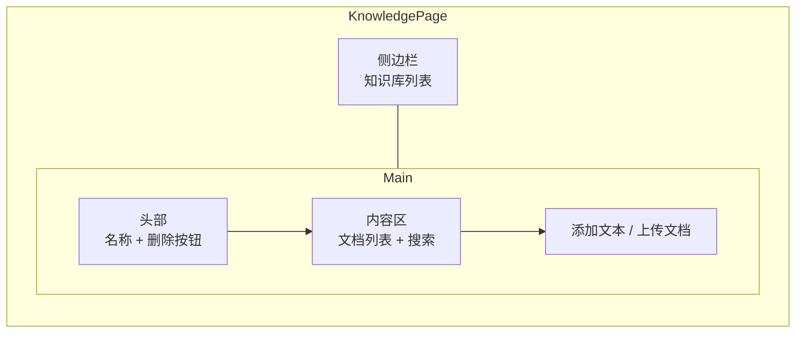
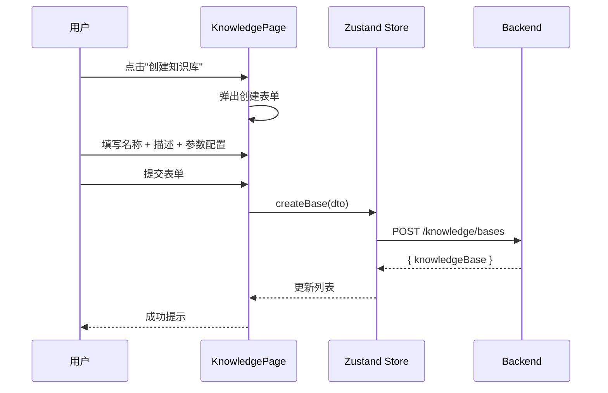
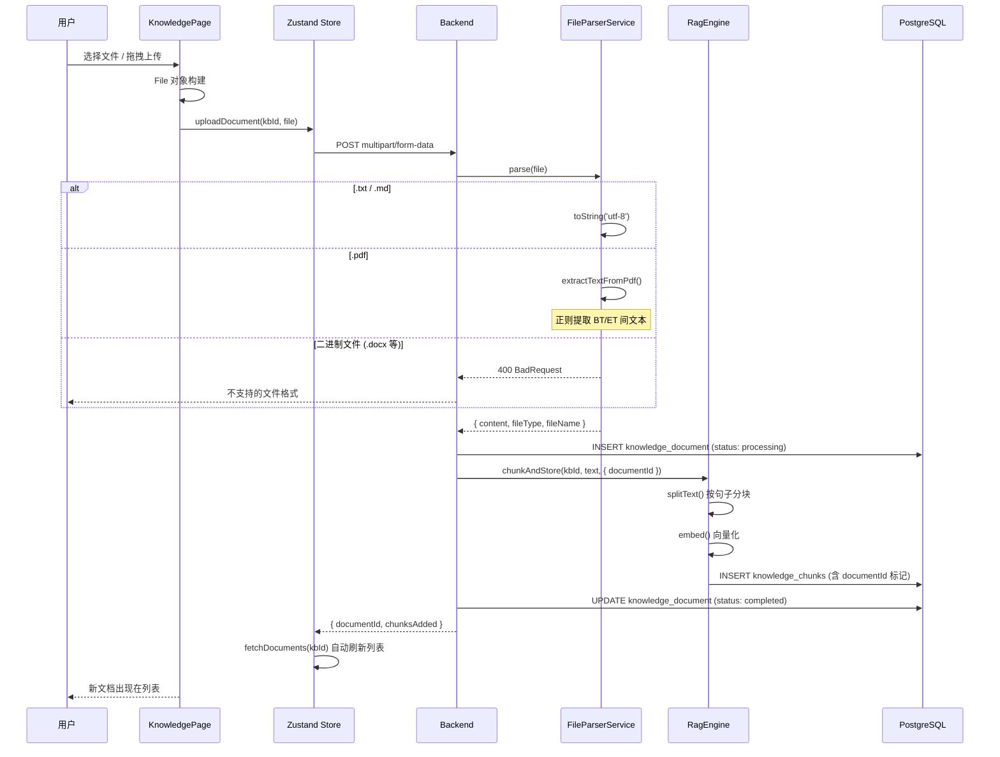
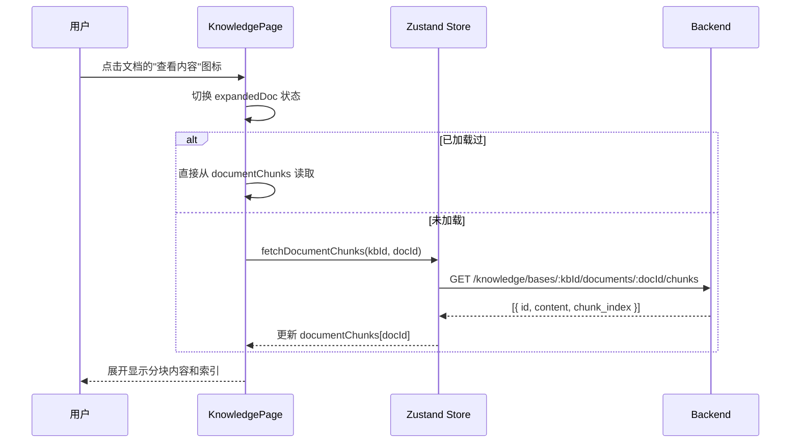

# 前端知识库管理页面

## 1. 功能概述

### 有什么用？

知识库管理页面允许用户**创建和管理私有知识库**、**上传文档**、**添加文本内容**，以及进行**语义搜索**。它与 AI Agent 深度集成 — 用户在 AI 对话时，Agent 的 `search_knowledge_base` 工具会自动检索知识库内容来增强回答。

### 如何使用？

| 功能 | 交互方式 | 说明 |
|------|---------|------|
| 创建知识库 | 填写名称和描述 | 可配置分块大小和重叠参数 |
| 上传文档 | 选择文件上传 | 支持 .txt .md .pdf .csv .json，自动提取文本 |
| 查看文档列表 | 选择知识库后自动显示 | 查看文件名、大小、状态、分块数 |
| 预览文档内容 | 点击文档的"查看"图标 | 查看从文件中提取的文本分块 |
| 删除文档 | 点击删除图标 → 确认 | 同时删除关联的知识块 |
| 添加文本 | 粘贴文本内容 | 直接输入知识文本 |
| 搜索知识库 | 输入搜索关键词 | 语义搜索，返回最相关的知识块 |
| 删除知识库 | 确认后删除 | 同时删除所有文档和向量数据 |

### 与 AI Agent 的集成

```
用户: "根据我的项目文档，数据库设计是怎样的？"
  AI Agent → classifyIntent("数据库设计")
           → 判断为 TOOL_USE，进入 ReAct 模式
           → 调用 search_knowledge_base(query: "数据库设计")
           → RAG 引擎检索知识库 → 获取相关知识块
           → LLM 基于检索结果生成回答
```

### 为什么要有这个功能？

- **知识私有化**：用户上传自己的文档（产品手册、技术文档、学习笔记），AI 能基于这些私有数据回答问题
- **降低幻觉**：AI 回答基于真实文档内容，而非模型训练数据中的"猜测"
- **主动集成**：无需手动切换到知识库页面，AI Agent 在对话中自动检索
- **持续更新**：新增文档后立即可检索，无需重新训练模型

---

## 2. 页面结构

### 组件树

```mermaid
graph TB
    KnowledgePage[KnowledgePage<br/>知识库管理页面] --> KBList[知识库列表]
    KnowledgePage --> KBDetail[知识库详情]

    KBList --> KBCard1[知识库卡片<br/>名称/描述/文档数]
    KBList --> KBCard2[...
    KBList --> CreateBtn[创建知识库按钮]

    KBDetail --> Header[知识库头部<br/>名称 + 刷新/删除按钮]
    KBDetail --> DocList[文档列表<br/>文件名/大小/状态/分块数]
    KBDetail --> DocContent[文档内容预览<br/>点击查看图标展开]
    KBDetail --> AddText[添加文本区域]
    KBDetail --> UploadBtn[上传文档按钮<br/>支持 .txt .md .pdf .csv .json]
    KBDetail --> Search[语义搜索框]

    DocList --> DocItem[文档项<br/>状态徽章 + 查看图标 + 删除按钮]
    DocItem --> ConfirmDelete[删除确认弹窗]
    DocItem --> ChunkPreview[分块内容展示<br/>折叠/展开]
    Search --> SearchResult[搜索结果<br/>知识块列表]
```

### 页面布局



---

## 3. 核心代码逻辑

### 3.1 知识库 CRUD

```typescript
// knowledge.store.ts — 完整文档管理
interface KnowledgeState {
  bases: KnowledgeBase[]
  currentBase: KnowledgeBase | null
  documents: KnowledgeDocument[]
  documentChunks: Record<string, DocumentChunk[]>  // docId → chunks
  documentsLoading: boolean
  chunksLoading: string | null  // 正在加载 chunk 的文档 ID
  searchResults: SearchResult[]
  loading: boolean

  fetchBases: () => Promise<void>
  fetchDocuments: (kbId: string) => Promise<void>
  fetchDocumentChunks: (kbId: string, docId: string) => Promise<void>
  createBase: (data: CreateKbDto) => Promise<void>
  deleteBase: (kbId: string) => Promise<void>
  deleteDocument: (kbId: string, docId: string) => Promise<void>
  addText: (kbId: string, content: string) => Promise<void>
  search: (query: string, topK?: number) => Promise<void>
  setCurrentBase: (kb: KnowledgeBase | null) => void
  refreshCurrentBase: () => Promise<void>
}
```

### 3.2 语义搜索

```typescript
// api/client.ts — 知识库 API
const knowledgeApi = {
  listBases: () => apiClient.get('/knowledge/bases'),
  createBase: (data: CreateKbDto) => apiClient.post('/knowledge/bases', data),
  getBase: (kbId: string) => apiClient.get(`/knowledge/bases/${kbId}`),
  deleteBase: (kbId: string) => apiClient.delete(`/knowledge/bases/${kbId}`),
  addText: (kbId: string, content: string, metadata?: any) =>
    apiClient.post(`/knowledge/bases/${kbId}/text`, { content, metadata }),
  uploadDocument: (kbId: string, file: File) => {
    const form = new FormData()
    form.append('file', file)
    return apiClient.post(`/knowledge/bases/${kbId}/documents`, form, {
      headers: { 'Content-Type': 'multipart/form-data' },
    })
  },
  search: (query: string, topK?: number) =>
    apiClient.get('/knowledge/search', { params: { query, topK } }),
}
```

---

## 4. 用户交互流程

### 创建知识库



### 文档上传与处理



### 文档内容预览



---

## 5. 文档状态与生命周期

### 状态流转

```
上传 → pending → processing → completed
                    ↓
                 failed
```

| 状态 | 说明 | UI 表现 |
|------|------|---------|
| **pending** | 文档记录已创建，等待处理 | 黄色徽章 |
| **processing** | 正在进行分块 + 向量化 | 蓝色徽章，显示进度 |
| **completed** | 处理完成，可被 AI 检索 | 绿色徽章，可查看内容 |
| **failed** | 处理出错（空文件/解析失败） | 红色徽章，显示错误原因 |

### 文档删除

删除文档时，级联删除步骤：
1. 查询 `knowledge_chunks` 中 `metadata->>'documentId' = docId` 的记录
2. 执行 `DELETE FROM knowledge_chunks` 删除关联分块
3. 删除 `knowledge_document` 记录
4. 前端列表实时更新（过滤掉已删除文档）

---

## 6. 文件格式处理

| 格式 | 解析方式 | 限制 |
|------|---------|------|
| `.txt` `.md` | UTF-8 文本读取 | 无 |
| `.pdf` | 正则提取 BT/ET 间文本 | 仅支持文本型 PDF，扫描件不支持 |
| `.csv` `.json` | UTF-8 文本读取 | 无 |
| `.docx` `.doc` | ❌ 不支持 | 需转换为 .txt 或 .pdf 上传 |

### 二进制内容检测

文件解析器内置 `isBinaryContent()` 检测：
- 扫描前 2000 个字符
- 检测替换字符 (U+FFFD) 和空字节 (U+0000)
- 若异常字符占比 >15%，判定为二进制文件，返回 400 错误

---

## 7. 关键设计决策

| 决策 | 选择 | 原因 |
|------|------|------|
| 文件上传 | multipart/form-data + FileParserService | 根据格式智能解析，非简单 UTF-8 读取 |
| PDF 解析 | 正则提取 BT/ET 文本对象 | 零依赖方案，不增加包体积 |
| 文档-分块关联 | metadata JSON 字段存储 documentId | 无需修改 Prisma Schema 即可实现级联删除 |
| 文档删除 | 级联删除分块 + 记录 | 保持无垃圾数据 |
| 内容预览 | 按文档 ID 查询分块，可折叠展开 | 用户可验证提取效果 |
| 二进制检测 | isBinaryContent() 启发式扫描 | 拒绝对 Word 等二进制文件的错误解析 |
| 搜索方式 | 语义搜索（非关键词） | 理解查询意图，而非简单的关键词匹配 |
| 文档处理 | 同步处理（控制器内完成） | 小文件可即时完成，大文件需优化 |
| 公开知识库 | isPublic 开关 | 支持团队共享知识库 |
