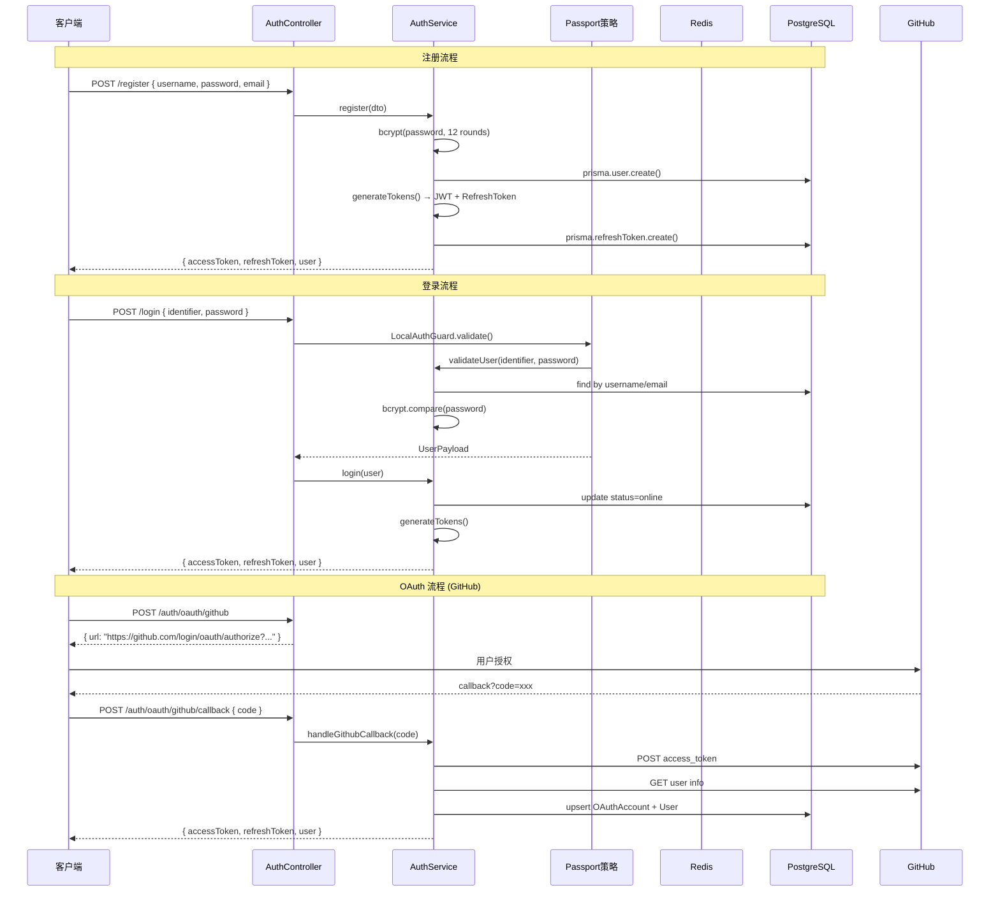
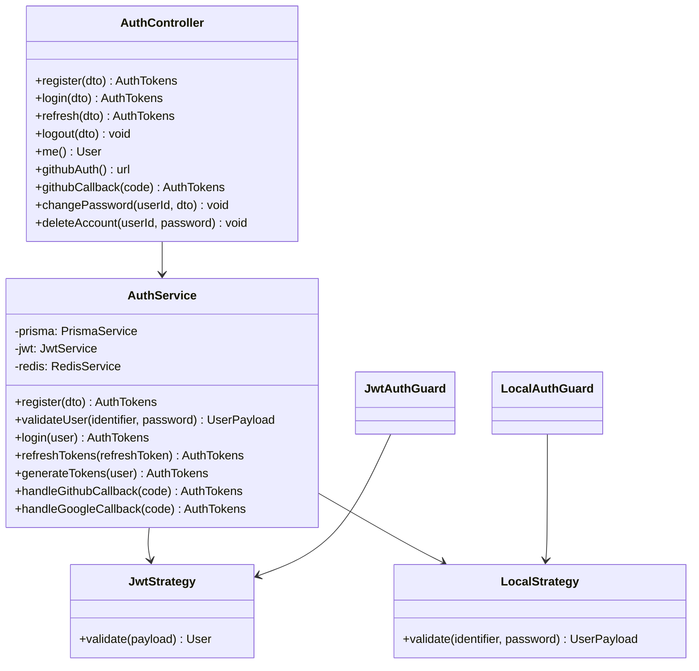
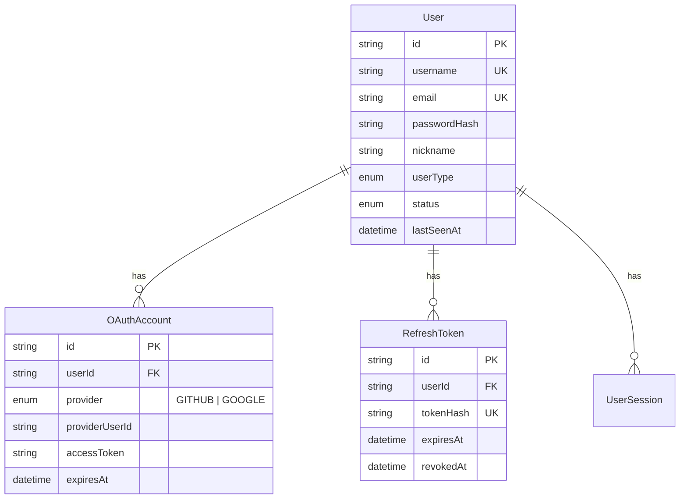

# 后端认证模块

## 1. 功能概述

### 有什么用？

认证模块是系统的入口守卫，负责处理用户的**身份注册、登录验证、会话管理**和**第三方 OAuth 登录**。它确保每个请求都由合法用户发出，并为用户提供便捷的多方式登录体验。

### 如何使用？

| 功能 | 使用方式 |
|------|---------|
| 注册 | `POST /api/v1/auth/register` — 提供用户名、密码、邮箱 |
| 登录 | `POST /api/v1/auth/login` — 用户名/邮箱 + 密码 |
| OAuth 登录 | 跳转 GitHub/Google OAuth 授权页 → 回调自动登录 |
| Token 刷新 | `POST /api/v1/auth/refresh` — 用 Refresh Token 换取新 Access Token |
| 登出 | `POST /api/v1/auth/logout` — 吊销 Refresh Token |
| 修改密码 | `POST /api/v1/auth/change-password` — 需原密码验证 |
| 重置密码 | 发送验证码 → 验证码校验 → 设置新密码 |

### 为什么要有这个功能？

- **安全性**：JWT 双令牌机制（Access Token 短期 + Refresh Token 长期）平衡安全与体验
- **便捷性**：OAuth 第三方登录让用户无需记忆新密码
- **可扩展性**：Passport 策略模式方便接入更多认证方式（如微信、飞书）
- **审计追踪**：每次认证操作均可记录审计日志

---

## 2. 架构设计

### 认证流程图



### 模块结构



---

## 3. 核心代码解释

### 3.1 JWT 双令牌机制

```typescript
// auth.service.ts — 令牌生成
private async generateTokens(user: UserPayload): Promise<AuthTokens> {
  // Access Token: 15分钟有效期，携带用户基本信息
  const accessToken = this.jwtService.sign(
    { sub: user.id, username: user.username },
    { expiresIn: '15m' },
  )

  // Refresh Token: 随机UUID，SHA-256哈希存入数据库
  const refreshToken = crypto.randomUUID()
  const tokenHash = crypto.createHash('sha256').update(refreshToken).digest('hex')

  await this.prisma.refreshToken.create({
    data: {
      userId: user.id,
      tokenHash,
      expiresAt: new Date(Date.now() + REFRESH_TTL_DAYS * 24 * 60 * 60 * 1000),
    },
  })

  return { accessToken, refreshToken, user }
}
```

**设计意图**：Access Token 短期有效（15 分钟），减少泄露风险；Refresh Token 长期有效（7 天）配合数据库存储，可服务端主动吊销。

### 3.2 令牌刷新（自动续期）

```typescript
// auth.service.ts — 刷新令牌
async refreshTokens(refreshToken: string): Promise<AuthTokens> {
  const tokenHash = crypto.createHash('sha256').update(refreshToken).digest('hex')

  const existing = await this.prisma.refreshToken.findUnique({
    where: { tokenHash },
    include: { user: true },
  })

  if (!existing || existing.revokedAt || existing.expiresAt < new Date()) {
    throw new UnauthorizedException('Invalid or expired refresh token')
  }

  // 轮换策略：吊销旧 Token，颁发新 Token
  await this.prisma.refreshToken.update({
    where: { id: existing.id },
    data: { revokedAt: new Date() },
  })

  return this.generateTokens({
    id: existing.user.id,
    username: existing.user.username,
    email: existing.user.email,
  })
}
```

**设计意图**：Refresh Token **轮换**（Rotation）策略 — 每次刷新都吊销旧 Token 并颁发新 Token，防止重放攻击。

### 3.3 OAuth 登录

```typescript
// auth.service.ts — GitHub OAuth 回调处理
async handleGithubCallback(code: string): Promise<AuthTokens> {
  // 1. 用 code 交换 access_token
  const tokenResponse = await axios.post(
    'https://github.com/login/oauth/access_token',
    { client_id, client_secret, code },
    { headers: { Accept: 'application/json' } },
  )

  // 2. 获取 GitHub 用户信息
  const githubUser = await axios.get('https://api.github.com/user', {
    headers: { Authorization: `Bearer ${tokenResponse.data.access_token}` },
  })

  // 3. upsert OAuthAccount → 自动创建或关联已有用户
  const account = await this.prisma.oAuthAccount.upsert({
    where: {
      provider_providerUserId: {
        provider: 'GITHUB',
        providerUserId: String(githubUser.data.id),
      },
    },
    create: {
      provider: 'GITHUB',
      providerUserId: String(githubUser.data.id),
      userId: user.id,
      accessToken: encrypt(tokenResponse.data.access_token),
    },
    update: { accessToken: encrypt(tokenResponse.data.access_token) },
  })

  return this.generateTokens({ id: user.id, username: user.username })
}
```

**设计意图**：通过 `upsert` 实现幂等的 OAuth 关联 — 用户首次使用 GitHub 登录时自动创建账号，后续使用则直接关联已有账号。

### 3.4 密码安全策略

```typescript
// auth.service.ts
const BCRYPT_ROUNDS = 12  // 迭代 4096 次，暴力破解成本极高

// 密码强度校验 (class-validator 自定义)
@IsStrongPassword()  // 要求: 长度 >= 8, 包含大小写字母和数字
```

---

## 4. 数据模型

### 核心表关系



---

## 5. 安全特性

| 特性 | 实现方式 |
|------|---------|
| **密码哈希** | bcryptjs，12 轮迭代 |
| **Token 哈希** | SHA-256 存储 Refresh Token |
| **令牌轮换** | 刷新时吊销旧 Token |
| **速率限制** | 登录 10次/分钟，注册 5次/分钟 |
| **OAuth 令牌加密** | 数据库中 OAuth access_token 加密存储 |
