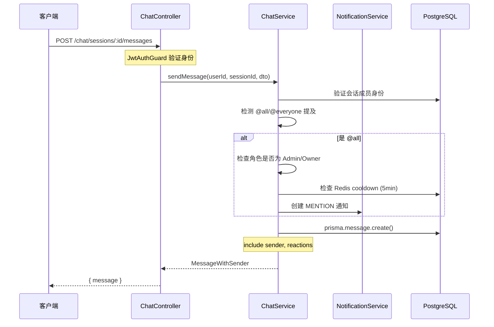
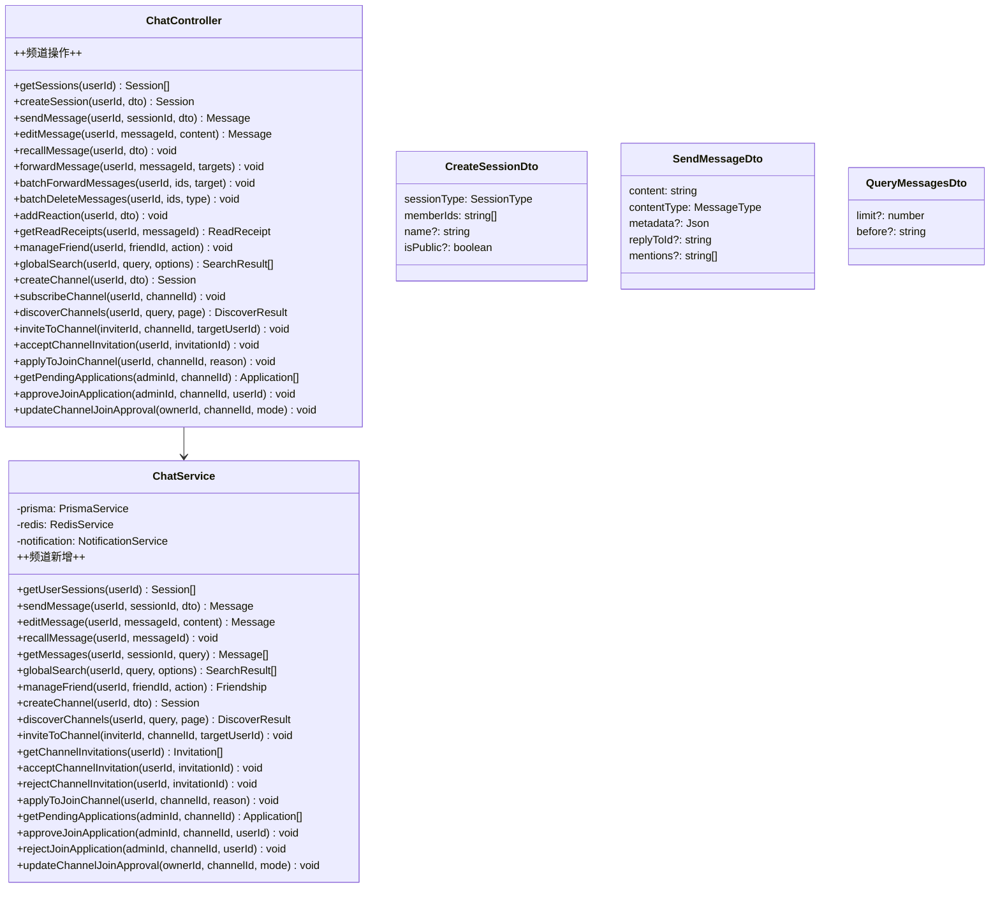
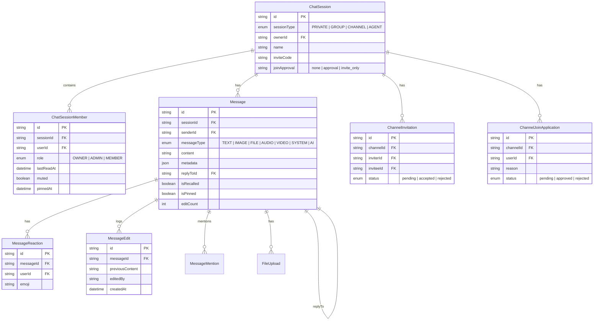

# 后端聊天模块

## 1. 功能概述

### 有什么用？

聊天模块是系统的核心业务模块，负责管理**聊天会话、消息收发、好友关系**、**群组管理**和**频道(Channel)功能**。它支撑了私聊、群聊、频道三种会话模式，并提供消息回复、转发、编辑、撤回、表情反应、已读回执等丰富的聊天交互能力。

频道是一种**一对多广播型**会话模式，支持公开浏览、邀请加入和加入审核三种访问控制方式。

### 如何使用？

| 功能 | API | 说明 |
|------|-----|------|
| 会话管理 | `GET/POST/PATCH/DELETE /chat/sessions` | 创建、查询、更新、删除会话 |
| 消息收发 | `POST /chat/sessions/:id/messages` | 发送消息（文本/图片/文件等） |
| 消息回复 | `SendMessageDto.replyToId` | 在发送消息时指定回复目标 |
| 消息转发 | `POST /chat/messages/forward` | 单条转发到多个会话 |
| 批量操作 | `POST /chat/messages/batch/forward\|delete` | 批量转发/删除（最多50条） |
| 消息撤回 | `POST /chat/messages/recall` | 5分钟内可撤回 |
| 消息编辑 | `PATCH /chat/messages/:id` | 15分钟内可编辑，保留编辑历史 |
| 表情反应 | `POST/DELETE /chat/reactions` | 添加/移除表情反应 |
| 已读回执 | `GET /chat/messages/:id/read-receipts` | 查看已读/未读成员 |
| 好友管理 | `GET/POST /chat/friends` | 好友请求/接受/拒绝/拉黑 |
| 会话置顶 | `PATCH /chat/sessions/:id/pin` | 置顶/取消置顶 |
| 会话静音 | `PATCH /chat/sessions/:id/mute` | 静音/取消静音 |
| 全局搜索 | `GET /chat/search` | 跨会话搜索消息 |
| 邀请链接 | `POST /chat/sessions/:id/invite-link` | 生成7天有效邀请码 |
| 群公告 | `POST /chat/sessions/:id/announcement` | 设置/移除群公告 |
| 消息收藏 | `POST /chat/messages/:id/bookmark` | 收藏/取消收藏 |
| **频道发现** | `GET /chat/channels/discover` | 浏览/搜索公开频道 |
| **频道订阅** | `POST /chat/channels/:id/subscribe` | 订阅或申请加入频道 |
| **频道邀请** | `POST /chat/channels/:id/invite` | 邀请指定用户加入频道 |
| **邀请处理** | `GET+POST /chat/channels/invitations` | 查看/接受/拒绝频道邀请 |
| **加入审核** | `POST /chat/channels/:id/apply` | 申请加入需要审核的频道 |
| **审批管理** | `GET+POST /chat/channels/:id/applications` | 查看/审批/拒绝加入申请 |
| **审核模式** | `PATCH /chat/channels/:id/join-approval` | 设置频道加入审核模式 |

### 为什么要有这个功能？

- **全功能通讯**：覆盖即时通讯的核心场景（私聊、群聊、频道），满足多样化沟通需求
- **消息可靠性**：支持消息编辑历史追溯、撤回机制、已读回执，保障消息的可信度
- **用户掌控力**：会话静音、置顶、收藏、批量管理等功能让用户自主管理信息流
- **频道广播**：支持一对多广播式信息发布，适用于公告、通知、内容分发等场景
- **访问控制**：三级加入模式（直接/审核/仅邀请）灵活管控频道成员准入
- **社交传播**：频道发现和邀请机制帮助频道自然增长
- **扩展性**：基于 Prisma ORM + PostgreSQL 的关系模型支撑复杂查询，cursor 分页保障大数据量性能

---

## 2. 架构设计

### 消息发送流程



### 会话列表组装

```typescript
// chat.service.ts
async getUserSessions(userId: string) {
  // 1. 查询用户的所有会话成员记录
  const memberships = await this.prisma.chatSessionMember.findMany({
    where: { userId },
    include: {
      session: {
        include: {
          owner: { select: { id: true, username: true, avatarUrl: true } },
          members: { take: 3, ... },  // 仅取最近3个成员用于头像拼接
          _count: { select: { members: true, messages: true } },
        },
      },
    },
  })

  // 2. 查询每个会话的最后一条消息
  const lastMessages = await Promise.all(
    sessions.map(s => this.prisma.message.findFirst({
      where: { sessionId: s.id },
      orderBy: { createdAt: 'desc' },
    })),
  )

  // 3. 排序规则: 置顶 > 最后消息时间
  return sessions
    .sort((a, b) => (b.pinnedAt ? 1 : 0) - (a.pinnedAt ? 1 : 0)
      || (b.lastMessage?.createdAt - a.lastMessage?.createdAt))
}
```

### 模块类图



---

## 3. 核心代码解释

### 3.1 私聊会话去重

```typescript
// chat.service.ts — 创建会话
async createSession(userId: string, dto: CreateSessionDto) {
  if (dto.sessionType === SessionType.PRIVATE && dto.memberIds?.length === 1) {
    const targetId = dto.memberIds[0]

    // 查找已有的私聊会话（双向查找）
    const existing = await this.prisma.chatSession.findFirst({
      where: {
        type: SessionType.PRIVATE,
        members: {
          every: { userId: { in: [userId, targetId] } },
        },
      },
    })
    if (existing) return existing  // 已有会话直接返回
  }
  // ...创建新会话
}
```

**设计意图**：防止同一个两人对反复创建多个私聊会话，保证私聊的唯一性。

### 3.2 消息编辑与历史追溯

```typescript
// chat.service.ts — 编辑消息
async editMessage(userId: string, messageId: string, newContent: string) {
  const message = await this.prisma.message.findUnique({ where: { id: messageId } })

  // 15 分钟编辑限制
  if (Date.now() - message.createdAt.getTime() > 15 * 60 * 1000) {
    throw new ForbiddenException('编辑时间已过（15分钟限制）')
  }

  // 保存当前版本到编辑历史
  await this.prisma.messageEdit.create({
    data: {
      messageId,
      previousContent: message.content,
      editedBy: userId,
    },
  })

  // 更新消息内容，递增编辑次数
  return this.prisma.message.update({
    where: { id: messageId },
    data: { content: newContent, editCount: { increment: 1 } },
  })
}
```

**设计意图**：编辑历史不可篡改，每次编辑都保留之前版本，便于消息审计和追溯。

### 3.3 已读回执（群聊）

```typescript
// chat.service.ts — 获取已读回执
async getReadReceipts(userId: string, messageId: string, page = 1, limit = 20) {
  const message = await this.prisma.message.findUnique({ where: { id: messageId } })

  // 获取所有成员的 lastReadAt
  const members = await this.prisma.chatSessionMember.findMany({
    where: { sessionId: message.sessionId },
    include: { user: { select: { id: true, username: true, avatarUrl: true } } },
  })

  // 比较 lastReadAt >= message.createdAt → 已读
  const read: Member[] = [], unread: Member[] = []
  for (const member of members) {
    if (member.lastReadAt >= message.createdAt) read.push(member)
    else unread.push(member)
  }

  return { read, unread, totalRead: read.length, totalUnread: unread.length }
}
```

**设计意图**：通过比较成员的 `lastReadAt` 与消息的 `createdAt` 来判断是否已读，无需额外存储每条消息的已读状态，空间效率高。

### 3.4 Cursor 分页

```typescript
// chat.service.ts — 获取消息
async getMessages(userId: string, sessionId: string, query: QueryMessagesDto) {
  const limit = Math.min(query.limit || 50, 200)  // 上限 200 条

  const messages = await this.prisma.message.findMany({
    where: {
      sessionId,
      ...(query.before ? { createdAt: { lt: new Date(query.before) } } : {}),
    },
    include: {
      sender: { select: { id: true, username: true, avatarUrl: true } },
      reactions: { select: { emoji: true, userId: true } },
      replyTo: true,
    },
    orderBy: { createdAt: 'desc' },
    take: limit + 1,  // 多取一条判断是否还有下一页
  })

  const hasMore = messages.length > limit
  if (hasMore) messages.pop()

  return { messages: messages.reverse(), hasMore }
}
```

**设计意图**：使用 cursor 分页而非传统 offset 分页，避免大偏移量时的性能问题；`take: limit + 1` 的技巧用于判断是否还有更多数据。

### 3.5 频道发现

```typescript
// chat.service.ts — 公开频道浏览
async discoverChannels(userId: string, query?: string, page = 1, limit = 20) {
  const where: any = {
    sessionType: 'channel',
    isPublic: true,
    members: { none: { userId } },  // 排除已订阅的
  }

  if (query) {
    where.OR = [
      { name: { contains: query, mode: 'insensitive' } },
      { description: { contains: query, mode: 'insensitive' } },
    ]
  }

  const [channels, total] = await Promise.all([
    this.prisma.chatSession.findMany({
      where,
      select: {
        id: true, name: true, description: true, avatarUrl: true,
        joinApproval: true, createdAt: true,
        owner: { select: { id: true, username: true, avatarUrl: true } },
        _count: { select: { members: true } },
      },
      orderBy: { createdAt: 'desc' },
      skip: (page - 1) * limit,
      take: limit,
    }),
    this.prisma.chatSession.count({ where }),
  ])

  return { items: channels, total, page, limit }
}
```

**设计意图**：`members: { none: { userId } }` 条件自动过滤已订阅频道，避免重复加入；支持名称和描述模糊搜索。

### 3.6 频道邀请流程

```typescript
// chat.service.ts — 邀请用户
async inviteToChannel(inviterId: string, channelId: string, targetUserId: string) {
  // 1. 校验邀请者身份（owner/admin）
  // 2. 校验目标用户存在且不是已有成员
  // 3. 校验唯一待处理邀请
  // 4. 创建 ChannelInvitation 记录
  // 5. 发送 CHANNEL_INVITATION 通知给目标用户

  const invitation = await this.prisma.channelInvitation.create({
    data: { channelId, inviterId, inviteeId: targetUserId, status: 'pending' },
  })

  await this.notificationService.create({
    userId: inviteeId,
    type: NotificationType.CHANNEL_INVITATION,
    title: '频道邀请',
    content: `${inviterName} 邀请你加入频道: ${channelName}`,
    data: { channelId, inviterId, invitationId: invitation.id },
  })

  return { invited: true }
}
```

**设计意图**：邀请记录唯一约束 `@@unique([channelId, inviteeId])` 防止重复邀请。邀请通过 `NotificationService` 实时推送到被邀请人的通知面板，支持 WebSocket 实时接收。

### 3.7 加入审核流程

```typescript
// chat.service.ts — 申请加入 — subscribeChannel 的分支逻辑
async subscribeChannel(userId: string, channelId: string) {
  // ... 前置校验 ...

  if (session.joinApproval === 'approval') {
    // 创建申请记录
    await this.prisma.channelJoinApplication.create({
      data: { channelId, userId, status: 'pending' },
    })
    // 通知所有管理员
    await this.notifyChannelAdmins(channelId, userId)
    return { subscribed: false, requiresApproval: true }
  }

  if (session.joinApproval === 'invite_only') {
    throw new ForbiddenException('This channel is invite-only')
  }

  // joinApproval === 'none' — 直接加入
  await this.prisma.chatSessionMember.create({
    data: { sessionId: channelId, userId, role: 'member' },
  })
  return { subscribed: true, alreadyMember: false }
}
```

**设计意图**：`subscribeChannel` 根据 `joinApproval` 字段走三条不同路径——无需审核直接加入、创建待审核申请并通知管理员、或拒绝仅邀请频道。审批通过后创建 `ChatSessionMember` 记录并推送 `JOIN_APPROVED` 通知。

---

## 4. 数据模型

### 消息相关表关系



---

## 5. 关键设计决策

| 决策 | 选择 | 原因 |
|------|------|------|
| 分页方式 | Cursor-based | Offset 分页在深度翻页时性能急剧下降 |
| 已读回执 | 比较 lastReadAt | 避免为每条消息存已读状态，空间换时间 |
| 消息编辑 | 完整编辑历史 | 消息作为沟通凭证需要可追溯 |
| 私聊去重 | 双向查询 | 防止同一对用户创建多个私聊会话 |
| @提及 | Redis cooldown | 5分钟内同一人只触发一次 @全员通知，防止骚扰 |
| **邀请审核新模型** | 独立表 `ChannelInvitation` + `ChannelJoinApplication` | 不修改 `ChatSessionMember`，避免影响现有会话逻辑 |
| **发现过滤** | `members: { none: { userId } }` | 简洁的 Prisma 查询，自动排除已订阅频道 |
| **审核模式** | ChatSession.joinApproval 字段 | 三种模式（none/approval/invite_only），subscribeChannel 内部分支 |
| **通知推送** | 复用 NotificationService | 所有邀请/审批通知实时推送到通知面板，前端 WebSocket 无缝接收 |

## 6. 频道邀请与会话邀请对比

| 特性 | 通用邀请链接 (invite-link) | 频道邀请 (invite to channel) |
|------|--------------------------|---------------------------|
| 触发方式 | 生成链接 → 分享给任何人 | 指定用户 → 发送邀请通知 |
| 适用范围 | 群聊 + 频道 | 仅频道 |
| 权限控制 | 无需校验 | 仅 owner/admin 可邀请 |
| 生命周期 | 7天过期 | 接受/拒绝后不可用 |
| 通知 | 无 | 实时推送 CHANNEL_INVITATION |
| 唯一约束 | 无 | 每人每频道仅一次待处理邀请 |
