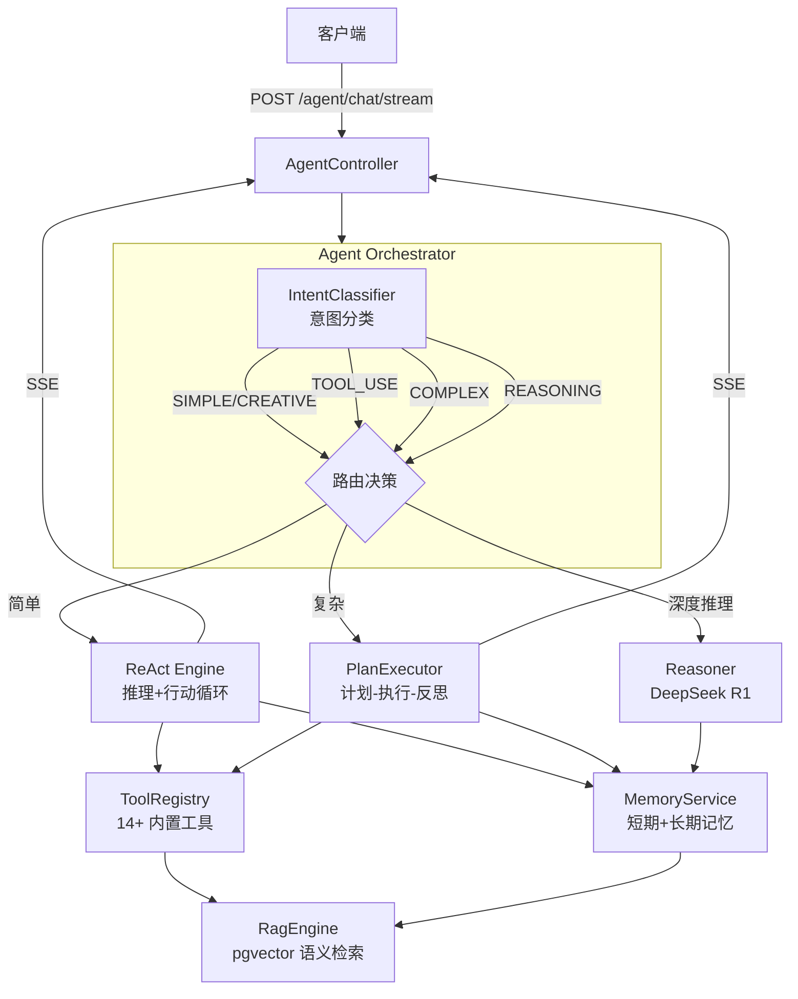
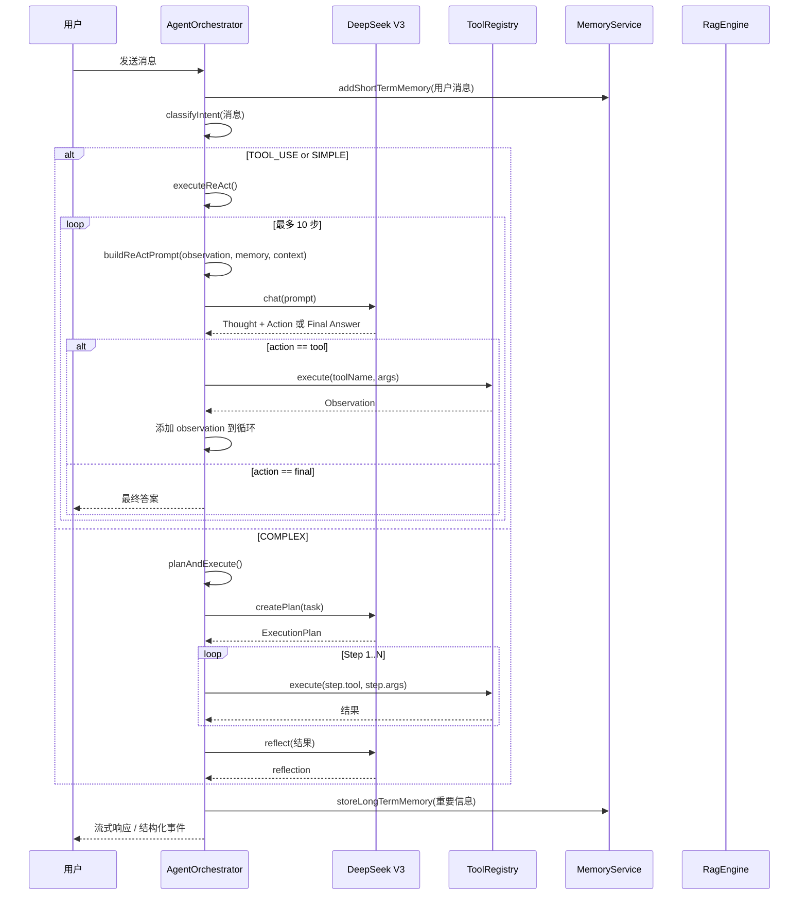
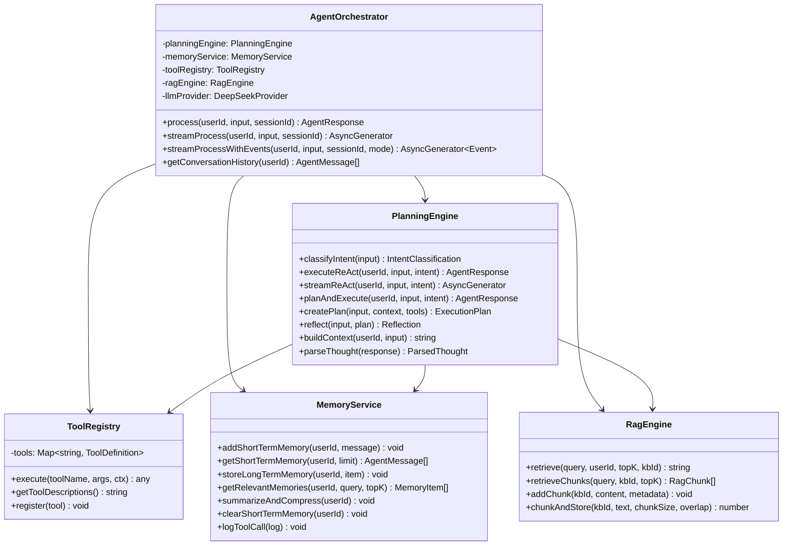
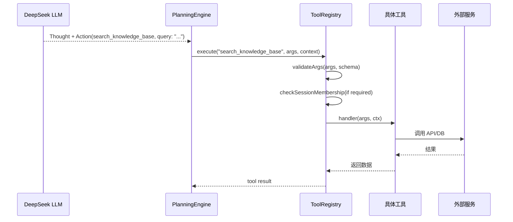
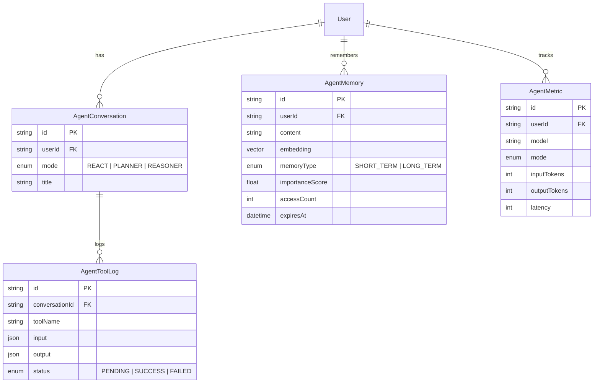

# 后端 AI Agent 模块

## 1. 功能概述

### 有什么用？

AI Agent 模块是本项目的核心差异化功能，它将 DeepSeek 大语言模型深度集成到聊天系统中，提供**智能对话助手**能力。支持三种推理模式：

- **ReAct（快速响应）**：思考 + 行动循环，适合需要调用工具的简单任务
- **Planner（计划执行）**：将复杂任务分解为多步骤计划逐步执行
- **Reasoner（深度推理）**：使用 DeepSeek R1 模型进行深度推理

同时具备**短期记忆**（Redis 30 分钟 TTL）和**长期记忆**（PostgreSQL + pgvector 向量存储）能力，并能通过 RAG 引擎检索用户私有知识库。

### 如何使用？

| 功能 | API | 说明 |
|------|-----|------|
| 非流式对话 | `POST /agent/chat` | 普通对话，完整响应 |
| 流式对话 | `POST /agent/chat/stream` | SSE 流式响应，实时展示思考过程 |
| 增强流式对话 | `POST /agent/chat/stream/enhanced` | 结构化事件流（type 区分 thinking/chunk/tool_call 等） |
| 对话历史 | `GET /agent/history` | 获取近期对话历史 |
| 清空记忆 | `DELETE /agent/memory` | 清空短期记忆 |
| 压缩记忆 | `POST /agent/memory/summarize` | LLM 总结后存入长期记忆 |
| 服务状态 | `GET /agent/status` | 查看 AI 服务运行状态 |

### 为什么要有这个功能？

- **AI-Native 体验**：将 LLM 嵌入聊天界面，用户无需切换工具即可获得 AI 帮助
- **场景全覆盖**：三种推理模式分别适配简单问答、复杂任务、深度推理
- **持续学习**：记忆系统让 AI 越来越了解用户，提供个性化服务
- **透明可靠**：流式输出 + 思考链展示 + 工具调用日志，让 AI 的推理过程完全透明

---

## 2. 架构设计

### Agent 整体架构



### ReAct 循环流程



### 模块类图



---

## 3. 核心代码解释

### 3.1 意图分类

```typescript
// planning-engine.service.ts — 意图分类
async classifyIntent(input: string): Promise<IntentClassification> {
  const prompt = `分析用户意图，返回 JSON：
{
  "type": "simple" | "complex" | "reasoning" | "creative",
  "confidence": 0.0-1.0,
  "reason": "..."
}

规则：
- SIMPLE: 简单问答，无需工具 → Direct LLM
- TOOL_USE: 需要查知识库、算数等 → ReAct
- COMPLEX: 多步骤任务 → Plan-and-Execute
- REASONING: 复杂逻辑/数学 → DeepSeek R1
- CREATIVE: 写作/创意 → Direct LLM`

  try {
    const response = await this.llmProvider.chat([{ role: 'user', content: prompt }])
    return JSON.parse(response)
  } catch {
    return { type: 'simple', confidence: 0.5 }
  }
}
```

**设计意图**：通过 LLM 自身进行意图分类，比规则引擎更灵活。错误时降级为 `simple` 保证可用性。

### 3.2 ReAct 循环

```typescript
// planning-engine.service.ts — ReAct 执行
async executeReAct(userId: string, input: string, intent: IntentClassification) {
  const maxSteps = MAX_REACT_STEPS  // 最多 10 步

  for (let step = 0; step < maxSteps; step++) {
    // 构建带上下文和工具描述的 Prompt
    const prompt = this.buildReActPrompt(input, observation, memory, context, tools, step)
    const response = await this.llmProvider.chat(prompt)
    const parsed = this.parseThought(response)

    // 解析 LLM 输出: Thought → Action(tool) 或 Final Answer
    if (parsed.action?.name === 'final') {
      return {
        type: 'final',
        content: parsed.action.input,
        reasoning: parsed.reasoning,
      }
    }

    // 执行工具调用
    if (parsed.action) {
      const result = await this.toolRegistry.execute(
        parsed.action.name,
        parsed.action.input,
        { userId, messages: memory },
      )
      // 将 observation 加入下一轮循环
      observation = `工具 "${parsed.action.name}" 返回: ${result}`
    }
  }
}
```

**设计意图**：ReAct 模式让 LLM 在"思考→行动→观察"循环中逐步推理，每一步都基于上一步的结果。10 步上限防止无限循环。

### 3.3 计划-执行-反思

```typescript
// planning-engine.service.ts — 创建执行计划
async createPlan(input: string, context: string, tools: string): Promise<ExecutionPlan> {
  const prompt = `任务: ${input}\n上下文: ${context}\n可用工具: ${tools}
请将上述任务分解为步骤，格式：
STEP-1: 描述 | 工具名 | 参数
STEP-2: 描述 | 工具名 | 参数
...`

  const response = await this.llmProvider.chat([{ role: 'user', content: prompt }])

  // 解析 STEP-1 格式
  const steps: PlanStep[] = []
  const regex = /STEP-(\d+):\s*(.+?)\s*\|\s*(\w+)\s*\|\s*({.+?)?/g
  let match
  while ((match = regex.exec(response)) !== null) {
    steps.push({
      id: parseInt(match[1]),
      description: match[2].trim(),
      tool: match[3].trim(),
      args: match[4] ? JSON.parse(match[4]) : {},
      status: 'pending',
    })
  }

  return { goal: input, steps }
}
```

**设计意图**：Plan-and-Execute 将复杂任务分解为可管理的子步骤，每个步骤调用具体工具。`reflect()` 方法在步骤执行完后评估结果，必要时重新规划。

### 3.4 流式响应架构

```typescript
// agent-orchestrator.service.ts — 增强流式响应
async *streamProcessWithEvents(userId: string, input: string, sessionId?: string, mode?: string) {
  yield { type: 'start', data: { sessionId } }

  // 根据 mode 路由到不同引擎
  if (mode === 'reasoner') {
    // DeepSeek R1 深度推理
    yield* this.planningEngine.streamReActWithEvents(userId, input, {
      ...intent, type: 'reasoning'
    })
  } else if (mode === 'planner') {
    // Plan-and-Execute
    yield* this.planningEngine.streamPlanAndExecuteWithEvents(userId, input, intent)
  } else {
    // ReAct 默认
    yield* this.planningEngine.streamReActWithEvents(userId, input, intent)
  }

  yield { type: 'done', data: { totalTokens, model: 'deepseek-v3' } }
}
```

**SSE 事件协议**：

| 事件类型 | 说明 | 前端用途 |
|---------|------|---------|
| `start` | 开始处理，含 sessionId | 初始化会话 |
| `thinking` | 思考内容 (reasoning) | ThinkingChain 展示 |
| `chunk` | 生成文本片段 | StreamingText 逐字显示 |
| `tool_call` | 工具调用开始 | ToolCallLog 添加条目 |
| `tool_result` | 工具调用完成 | ToolCallLog 更新结果 |
| `final` | 最终答案 | 完成消息渲染 |
| `done` | 全部完成 | 关闭流式状态 |
| `error` | 错误信息 | 错误提示 |

### 3.5 记忆系统

```typescript
// memory.service.ts — 短期记忆
async addShortTermMemory(userId: string, message: AgentMessage) {
  const key = `memory:short:${userId}`
  await this.redis.lpush(key, JSON.stringify(message))
  await this.redis.ltrim(key, 0, 99)  // 最多保留 100 条
  await this.redis.expire(key, SHORT_TERM_TTL)  // 30 分钟 TTL
}

// memory.service.ts — 长期记忆（向量检索）
async getRelevantMemories(userId: string, query: string, topK = 5): Promise<MemoryItem[]> {
  return this.prisma.$queryRaw`
    SELECT * FROM agent_memories
    WHERE "userId" = ${userId}
      AND "memoryType" IN ('episodic', 'semantic')
      AND ("expiresAt" IS NULL OR "expiresAt" > NOW())
    ORDER BY "importanceScore" DESC
    LIMIT ${topK}
  `
}
```

**设计意图**：双级记忆架构 — 短期记忆（Redis）提供快速访问和自动过期；长期记忆（pgvector）持久化存储重要信息并通过语义检索召回。记忆压缩在短期记忆超过 10 条时触发 LLM 摘要。

---

## 4. 工具系统

### 注册的内置工具

| 工具名 | 功能 | 输入 |
|--------|------|------|
| `web_search` | DuckDuckGo 互联网搜索 | query: string |
| `search_knowledge_base` | 私有知识库 RAG 检索 | query: string |
| `get_user_info` | 查询用户信息 | userId: string |
| `get_friends_list` | 获取好友列表 | — |
| `get_online_friends` | 获取在线好友 | — |
| `send_message` | 发送聊天消息 | sessionId, content |
| `create_chat_session` | 创建聊天会话 | memberIds, type |
| `search_users` | 搜索用户 | query: string |
| `get_conversation_history` | 获取聊天历史 | sessionId |
| `calculate` | 数学计算 | expression: string |
| `get_time` | 获取当前时间 | timezone?: string |
| `get_weather` | 查询天气 | city: string |
| `record_metric` | 记录使用指标 | model, tokens, latency |

```typescript
// tool-registry.service.ts — 工具定义接口
interface ToolDefinition {
  name: string
  description: string
  parameters: Record<string, { type: string; description: string; required?: boolean }>
  requiresSessionMembership?: boolean
  handler: (args: any, ctx: AgentContext) => Promise<any>
}
```

### 工具执行流程



---

## 5. 数据模型

### Agent 相关表关系



---

## 6. 关键设计决策

| 决策 | 选择 | 原因 |
|------|------|------|
| 推理模式 | 3 种模式（ReAct/Planner/Reasoner） | 不同复杂度任务匹配不同策略 |
| 意图分类 | LLM 自分类 | 比规则更灵活，错误可降级 |
| 工具调用 | 注册表模式 | 新增工具只需注册，无需修改流程 |
| 短期记忆 | Redis LPUSH + TTL | 快速读写，自动淘汰 |
| 长期记忆 | pgvector 向量检索 | 语义级记忆召回 |
| 流式协议 | SSE + 结构化事件 | 前端可区分 thinking/chunk/tool_call 做出不同 UI 展示 |
| ReAct 步数限制 | 最多 10 步 | 防止无限循环消耗 Token |
