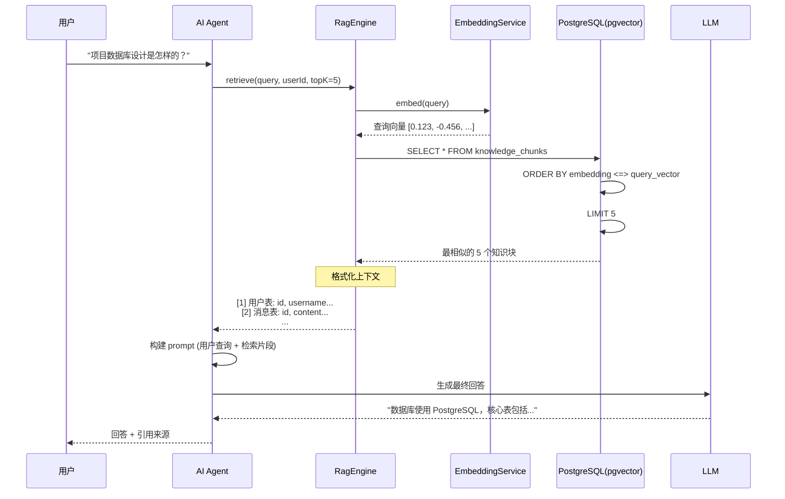
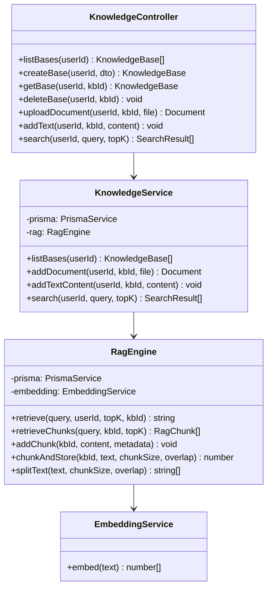
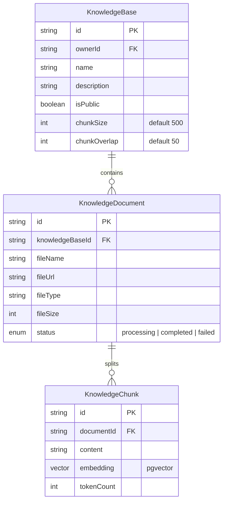

# 后端知识库 RAG 模块

## 1. 功能概述

### 有什么用？

知识库 RAG（Retrieval-Augmented Generation，检索增强生成）模块允许用户**上传文档构建私有知识库**，在 AI 对话时自动检索相关知识作为上下文，让 AI 的回答基于用户提供的私有数据，而非仅仅依赖模型训练数据。

### 如何使用？

| 功能 | API | 说明 |
|------|-----|------|
| 创建知识库 | `POST /knowledge/bases` | 创建知识库，配置分块参数 |
| 上传文档 | `POST /knowledge/bases/:id/documents` | 上传文件（PDF/TXT 等），自动分块向量化 |
| 添加文本 | `POST /knowledge/bases/:id/text` | 直接粘贴文本内容 |
| 语义搜索 | `GET /knowledge/search?query=xxx` | 跨知识库语义搜索 |
| 管理知识库 | `GET/DELETE /knowledge/bases/:id` | 查看详情 / 删除 |

### Agent 自动调用

在 AI Agent 对话中，工具 `search_knowledge_base` 会自动检索用户允许的知识库，无需手动切换：

```
用户: "根据我的项目文档，数据库设计是怎样的？"
AI Agent → 调用 search_knowledge_base(query: "数据库设计")
        → RAG 引擎检索相关知识块
        → LLM 基于检索结果生成回答
```

### 为什么要有这个功能？

- **私域知识注入**：让 AI 了解用户的私有数据（产品文档、技术手册、学习笔记等）
- **减少幻觉**：RAG 让 AI 的回答基于真实文档，而非模型"猜测"
- **实时更新**：新增文档后立即可被检索到，无需重新训练模型
- **数据安全**：知识库按用户隔离，私有知识库仅创建者可访问

---

## 2. 架构设计

### RAG 检索流程



### 文档处理流程

```mermaid
flowchart LR
    A[上传文档/文本] --> B{文档类型?}
    B -->|文本| C[splitText<br/>按句子分块]
    B -->|文件| D[读取内容]
    D --> C
    C --> E[chunkAndStore<br/>chunkSize=500, overlap=50]
    E --> F[EmbeddingService<br/>embed(chunk)]
    F --> G[pgvector 存储<br/>knowledge_chunks]
    G --> H[更新文档状态<br/>processing→completed]
```

### 模块类图



---

## 3. 核心代码解释

### 3.1 文本分块策略

```typescript
// rag-engine.service.ts — 智能文本分块
splitText(text: string, chunkSize = 500, overlap = 50): string[] {
  // 1. 按句子边界分割（支持中英文标点）
  const sentences = text.split(/[.!?。！？\n]+/).filter(s => s.trim().length > 0)

  const chunks: string[] = []
  let currentChunk = ''

  for (const sentence of sentences) {
    // 2. 如果当前块 + 新句子超过 chunkSize，保存当前块并开始新块
    if (currentChunk.length + sentence.length > chunkSize && currentChunk.length > 0) {
      chunks.push(currentChunk.trim())

      // 3. overlap 机制：保留当前块末尾部分字符作为下一块的上下文
      const overlapText = currentChunk.slice(-overlap)
      currentChunk = overlapText + sentence
    } else {
      currentChunk += sentence
    }
  }

  if (currentChunk.trim().length > 0) chunks.push(currentChunk.trim())
  return chunks
}

async chunkAndStore(kbId: string, text: string, chunkSize = 500, overlap = 50) {
  const chunks = this.splitText(text, chunkSize, overlap)

  for (const chunk of chunks) {
    // 跳过过短的块（纯标点等噪声）
    if (chunk.length < 10) continue

    try {
      await this.addChunk(kbId, chunk, { chunkIndex: i + 1 })
    } catch (error) {
      // 单个块失败不影响其他块
      console.error(`Chunk ${i} embedding failed:`, error.message)
    }
  }

  return chunks.length
}
```

**设计意图**：按句子（而非固定字符数）分割保持语义完整性；`overlap` 参数让相邻块有部分重叠，避免关键信息恰好落在切分边界上被丢失。

### 3.2 向量检索（pgvector）

```typescript
// rag-engine.service.ts — 语义检索
async retrieveChunks(query: string, kbId?: string, topK = 5): Promise<RagChunk[]> {
  // 1. 将查询文本转为向量
  const queryEmbedding = await this.embeddingService.embed(query)
  if (!queryEmbedding || queryEmbedding.length === 0) return []

  // 2. pgvector 余弦距离检索 (`<=>` 操作符)
  const kbFilter = kbId
    ? Prisma.sql`AND k."knowledgeBaseId" = ${kbId}::uuid`
    : Prisma.empty

  const chunks = await this.prisma.$queryRaw<RagChunk[]>`
    SELECT
      k.id, k.content, k."knowledgeBaseId",
      (k.embedding <=> ${queryEmbedding}::vector) AS distance
    FROM knowledge_chunks k
    WHERE 1=1 ${kbFilter}
    ORDER BY distance ASC
    LIMIT ${topK}
  `

  return chunks.map(c => ({
    ...c,
    score: 1 - c.distance,  // 距离越小 → 分数越高
  }))
}
```

**设计意图**：`<=>` 是 pgvector 的余弦距离操作符，值越小表示语义越接近。通过原始 SQL 查询绕过 Prisma 对 pgvector 类型支持的限制。

### 3.3 知识库搜索（跨库聚合）

```typescript
// knowledge.service.ts — 跨知识库搜索
async search(userId: string, query: string, topK = 5) {
  // 查找用户可访问的所有知识库
  const bases = await this.prisma.knowledgeBase.findMany({
    where: {
      OR: [{ ownerId: userId }, { isPublic: true }],
    },
  })

  // 逐个检索
  const results = await Promise.all(
    bases.map(async (base) => {
      const chunks = await this.ragEngine.retrieveChunks(query, base.id, topK)
      return { kbId: base.id, kbName: base.name, chunks }
    }),
  )

  return results.filter(r => r.chunks.length > 0)
}
```

### 3.4 文档上传处理

```typescript
// knowledge.service.ts — 文档上传与处理
async addDocument(userId: string, kbId: string, file: Express.Multer.File) {
  // 1. 创建文档记录，状态为 processing
  const doc = await this.prisma.knowledgeDocument.create({
    data: {
      knowledgeBaseId: kbId,
      fileName: file.originalname,
      fileUrl: `uploads/${file.filename}`,
      fileType: file.mimetype,
      fileSize: file.size,
      status: 'processing',
    },
  })

  try {
    // 2. 按文件类型读取文本内容
    const content = readFileContent(file)

    // 3. 分块 + 向量化存储
    const chunkCount = await this.ragEngine.chunkAndStore(kbId, content)

    // 4. 更新状态为 completed
    return this.prisma.knowledgeDocument.update({
      where: { id: doc.id },
      data: { status: 'completed' },
    })
  } catch (error) {
    // 5. 失败标记
    return this.prisma.knowledgeDocument.update({
      where: { id: doc.id },
      data: { status: 'failed' },
    })
  }
}
```

---

## 4. 数据模型

### 知识库相关表关系



---

## 5. 关键设计决策

| 决策 | 选择 | 原因 |
|------|------|------|
| 向量数据库 | pgvector（PostgreSQL 扩展） | 无需额外部署向量数据库，利用现有 PostgreSQL |
| 分块策略 | 按句子分割 + overlap | 保持语义完整，关键信息不丢失 |
| 检索方式 | 余弦距离 (<=>) | 语义相似度最常用的度量方式 |
| Embedding 模型 | DeepSeek / OpenAI 可选 | 灵活适配不同成本和精度需求 |
| 文档异步处理 | processing → completed | 大文档处理不阻塞上传响应 |
| 访问控制 | 所有者 / 公开 | 数据安全与共享的平衡 |
