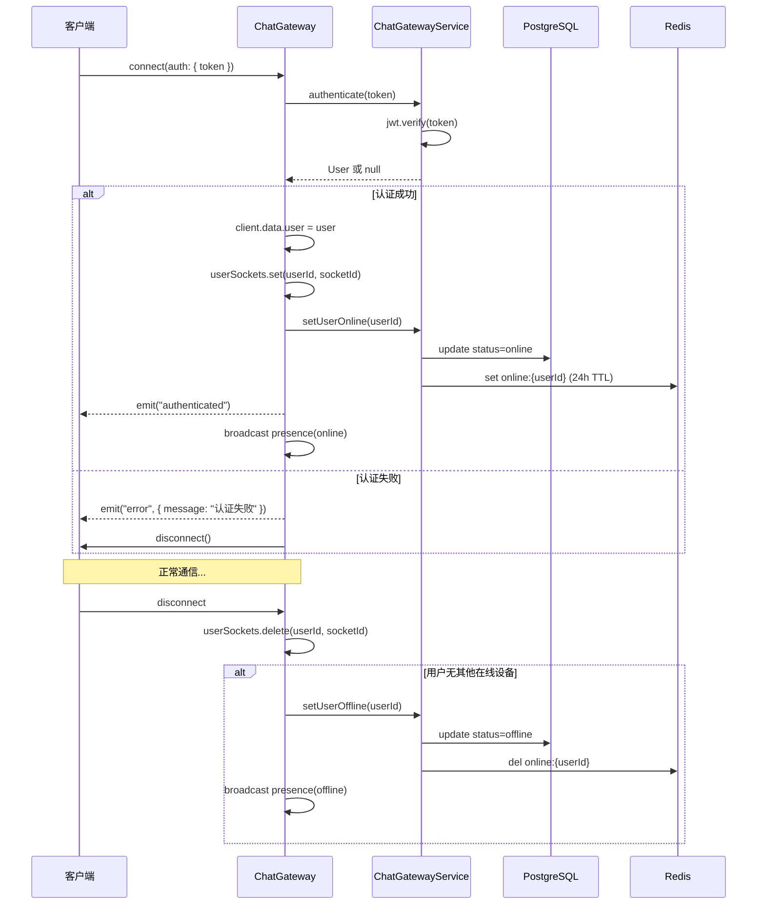
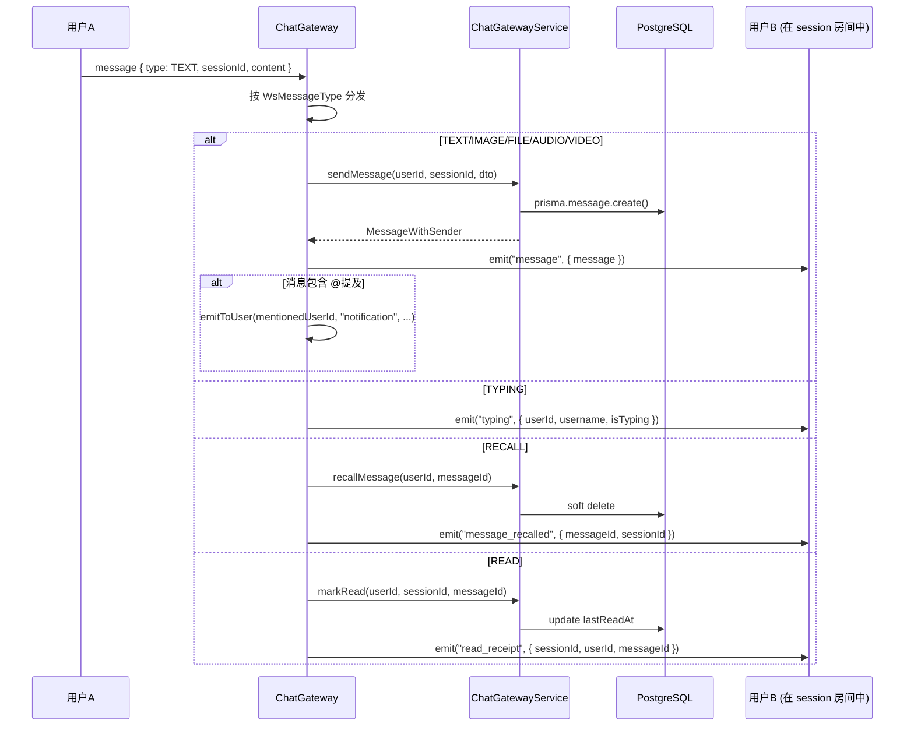
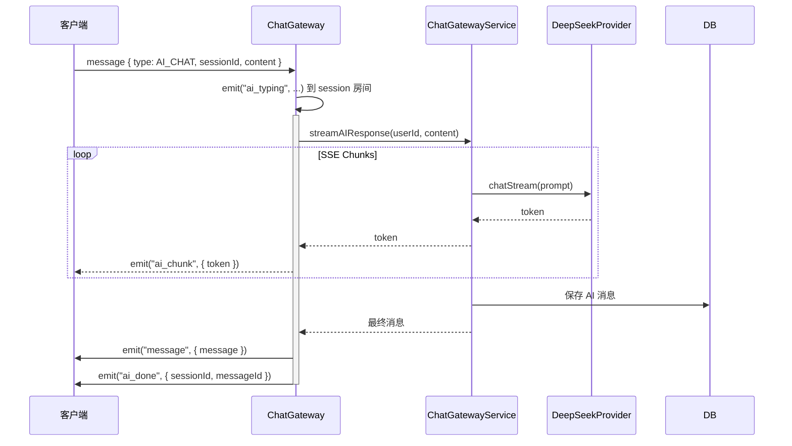

# 后端 WebSocket 网关

## 1. 功能概述

### 有什么用？

WebSocket 网关基于 Socket.io 实现**实时双向通信**，是系统的实时消息推送骨干。它负责消息的**即时收发**、**在线状态同步**、**输入状态广播**、**已读回执推送**和 **AI 流式响应**等核心实时功能。

### 如何使用？

**连接认证：**
```javascript
// 客户端连接示例
const socket = io('ws://localhost:3000/chat', {
  auth: { token: 'your-jwt-access-token' },
})
```

**客户端 ➜ 服务端事件：**

| 事件 | 载荷 | 说明 |
|------|------|------|
| `join_session` | `{ sessionId }` | 加入聊天会话房间 |
| `leave_session` | `{ sessionId }` | 离开聊天会话房间 |
| `message` | `{ type, sessionId, content, metadata? }` | 发送消息 |
| `message` (TYPING) | `{ type: 8, sessionId, isTyping }` | 正在输入 |
| `edit_message` | `{ messageId, content, sessionId }` | 编辑消息 |
| `reaction` | `{ messageId, emoji, sessionId }` | 添加表情反应 |
| `join_agent` | `{ sessionId? }` | 加入 AI 会话 |

**服务端 ➜ 客户端事件：**

| 事件 | 载荷 | 说明 |
|------|------|------|
| `message` | `{ message }` | 新消息推送 |
| `message_recalled` | `{ messageId, sessionId }` | 消息撤回通知 |
| `message_edited` | `{ messageId, sessionId, content, editCount }` | 消息编辑通知 |
| `read_receipt` | `{ sessionId, userId, messageId }` | 已读回执 |
| `typing` | `{ sessionId, userId, username, isTyping }` | 正在输入状态 |
| `presence` | `{ userId, status }` | 用户上下线通知 |
| `reaction` | `{ messageId, sessionId, emoji, userId }` | 表情反应广播 |
| `ai_chunk` | `{ token }` | AI 流式响应片段 |
| `ai_thinking` | `{ step, thought, action, observation }` | AI 思考过程 |
| `ai_tool_call` | `{ tool, input, output, status }` | AI 工具调用 |
| `notification` | `{ notification }` | 系统通知推送 |

### 为什么要有这个功能？

- **实时性**：HTTP 轮询方式延迟高、资源浪费，WebSocket 提供真正的实时推送
- **消息精确路由**：Socket.io 的 Room 机制确保消息只推送给相关会话成员
- **状态同步**：在线状态、输入状态等即时变化需要双向实时通道
- **AI 流式输出**：Agent 的流式响应需要持续推送数据片段，HTTP SSE 外也需要 WebSocket 通道支持

---

## 2. 架构设计

### 连接生命周期



### 消息路由流程



### AI 聊天 WebSocket 流程



---

## 3. 核心代码解释

### 3.1 多设备连接管理

```typescript
// chat.gateway.ts — 多设备支持
export class ChatGateway implements OnGatewayConnection, OnGatewayDisconnect {
  @WebSocketServer() server: Server

  // userId → Set<socketId> 映射
  private userSockets = new Map<string, Set<string>>()

  async handleConnection(client: Socket) {
    const token = client.handshake.auth?.token
      || client.handshake.headers.authorization?.replace('Bearer ', '')

    const user = await this.chatGatewayService.authenticate(token)

    if (!user) {
      client.emit('error', { message: 'Invalid token' })
      client.disconnect()
      return
    }

    // 存储用户信息到 socket 实例
    client.data.user = user

    // 追踪该用户的所有 socket 连接
    if (!this.userSockets.has(user.id)) {
      this.userSockets.set(user.id, new Set())
    }
    this.userSockets.get(user.id).add(client.id)

    await this.chatGatewayService.setUserOnline(user.id)
    this.server.emit('presence', { userId: user.id, status: 'online' })
    client.emit('connected', { userId: user.id })
  }

  async handleDisconnect(client: Socket) {
    const user = client.data.user as UserPayload
    if (!user) return

    // 移除 socket 引用
    const sockets = this.userSockets.get(user.id)
    sockets?.delete(client.id)

    // 仅当用户没有任何在线设备时才置为离线
    if (!sockets || sockets.size === 0) {
      this.userSockets.delete(user.id)
      await this.chatGatewayService.setUserOffline(user.id)
      this.server.emit('presence', { userId: user.id, status: 'offline' })
    }
  }
}
```

**设计意图**：`userSockets` Map 支持同一用户多设备登录（Web + 移动端），只有当所有设备都断开时才标记离线。

### 3.2 消息分发器

```typescript
// chat.gateway.ts — 消息事件调度
@SubscribeMessage('message')
async handleMessage(client: Socket, payload: WsIncomingMessage) {
  const user = client.data.user

  switch (payload.type) {
    case WsMessageType.TEXT:
    case WsMessageType.IMAGE:
    case WsMessageType.FILE:
    case WsMessageType.AUDIO:
    case WsMessageType.VIDEO: {
      const message = await this.chatGatewayService.sendMessage(
        user.id, payload.data.sessionId, payload.data,
      )
      // 广播到会话房间
      this.server.to(`session:${payload.data.sessionId}`).emit('message', message)

      // @提及通知
      if (message.mentions?.length) {
        for (const mention of message.mentions) {
          this.emitToUser(mention.userId, 'notification', {
            type: 'MENTION',
            message: `${user.username} 在消息中提到了你`,
          })
        }
      }
      break
    }

    case WsMessageType.TYPING:
      // 排除发送者
      client.to(`session:${payload.data.sessionId}`).emit('typing', {
        sessionId: payload.data.sessionId,
        userId: user.id,
        username: user.username,
        isTyping: payload.data.isTyping,
      })
      break

    case WsMessageType.RECALL: {
      await this.chatGatewayService.recallMessage(user.id, payload.data.messageId)
      this.server.to(`session:${payload.data.sessionId}`).emit('message_recalled', {
        messageId: payload.data.messageId,
        sessionId: payload.data.sessionId,
      })
      break
    }
  }
}
```

**设计意图**：使用 `switch` 枚举 `WsMessageType` 进行消息分发，比 if-else 链更清晰可维护。`client.to(room)` 排除发送者自身接收自己发出的消息。

### 3.3 消息编辑实时同步

```typescript
// chat.gateway.ts — 编辑消息同步
@SubscribeMessage('edit_message')
async handleEditMessage(client: Socket, payload: { messageId: string; content: string; sessionId: string }) {
  const user = client.data.user

  try {
    const updated = await this.chatGatewayService.editMessage(
      user.id, payload.messageId, payload.content,
    )

    // 广播编辑通知到会话房间内的所有客户端
    this.server.to(`session:${payload.sessionId}`).emit('message_edited', {
      messageId: payload.messageId,
      sessionId: payload.sessionId,
      content: updated.content,
      editCount: updated.editCount,
    })
  } catch (error) {
    client.emit('error', { message: '编辑失败: ' + error.message })
  }
}
```

---

## 4. 事件类型定义

```typescript
// chat.gateway.ts — WebSocket 消息类型枚举
enum WsMessageType {
  LOGIN = 0,
  PING = 1,
  TEXT = 2,     // 文本消息
  IMAGE = 3,    // 图片消息
  FILE = 4,     // 文件消息
  AUDIO = 5,    // 语音消息
  VIDEO = 6,    // 视频消息
  RECALL = 7,   // 撤回
  TYPING = 8,   // 正在输入
  AT = 9,       // @提及
  READ = 10,    // 已读回执
  NOTICE = 11,  // 系统通知
  AI_CHAT = 12, // AI 对话
}

interface WsIncomingMessage {
  type: WsMessageType
  data: any
  timestamp?: number
}
```

---

## 5. 架构图

### 房间模型

```mermaid
graph TB
    subgraph Socket.IO Server
        NS[/chat namespace]

        subgraph Rooms
            S1[session:uuid-1<br/>用户A, 用户B, 用户C]
            S2[session:uuid-2<br/>用户A, 用户D]
            A1[agent:uuid-3<br/>用户E]
        end

        subgraph UserSockets
            US1[用户A: socket1, socket2]
            US2[用户B: socket3]
        end
    end

    C1[浏览器 Tab 1] --> NS
    C2[浏览器 Tab 2] --> NS
    C3[用户B 客户端] --> NS

    NS --> S1
    NS --> S2
    NS --> A1
```

---

## 6. 关键设计决策

| 决策 | 选择 | 原因 |
|------|------|------|
| 框架 | Socket.io | 自动回退、房间管理、命名空间等开箱即用 |
| 消息类型 | 数字枚举 | 二进制友好，减少传输体积 |
| 房间标识 | `session:{id}` 和 `agent:{id}` | 不同业务隔离 |
| 在线状态 | Redis + DB 双写 | Redis 快速读取在线用户，DB 持久化 |
| 多设备 | userSockets Map 跟踪 | 同一用户多 Tab / 多设备互不干扰 |
| @提及推送 | emitToUser 定向推送 | 精确通知到被提及者，不打扰其他人 |
